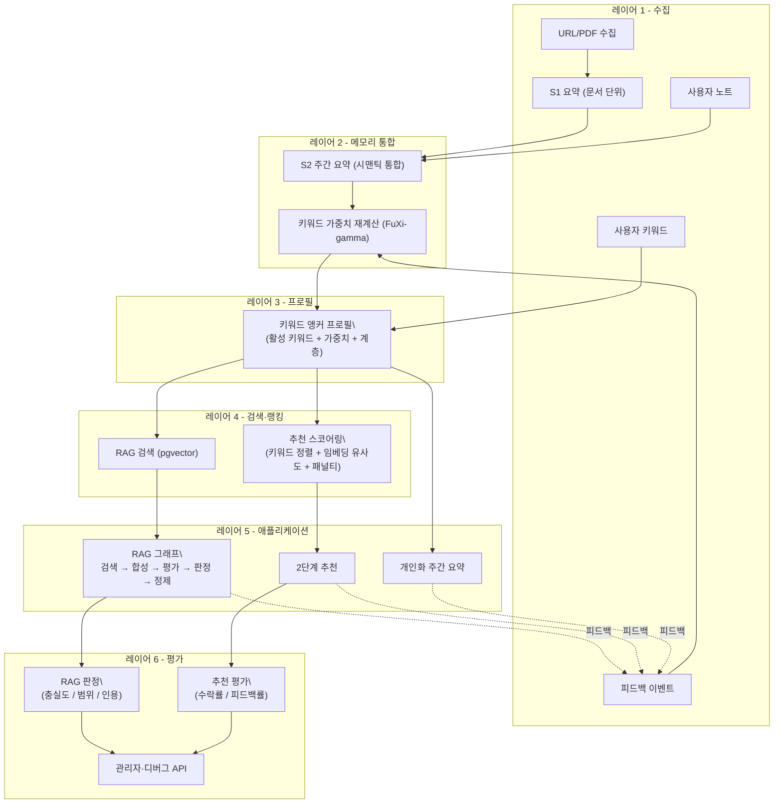

# My Learning Agent

**메모리 기반 개인화 학습 어시스턴트**

> 시간이 지날수록 누적되는 개인화 학습 도우미:  
> **수집(Ingest) → S1 → RAG → S2 → 1단계 키워드 방향 → 2단계 논문 추천 → 피드백 플라이휠**

**English:** [README.md](README.md)

---

## 요약 (Executive Summary)

My Learning Agent는 범용 AI 래퍼가 아닙니다.  
읽기 이력·노트·피드백을 주차 단위로 통합해 **키워드 앵커 프로필**로 만들고, 그 프로필로 검색과 추천을 매주 개선하는 **시스템 수준의 장기 개인화 아키텍처**입니다.

이 문서는 엔지니어링 리더가 **애플리케이션 코드를 읽지 않고도** 내부가 일관적인지, 트레이드오프가 드러나 있는지, 학습 궤적이라는 제품 가설이 납득 가능한지 판단할 수 있도록 **아키텍처 백서** 형태로 썼습니다.

---

## 왜 중요한가

대부분의 AI 독서 도구는 단기 편의(“이 문서 요약해 줘”)에 맞춰져 있습니다.  
이 시스템은 학습 궤적(“이 사용자의 연구 방향이 시간에 따라 어떻게 변하는가?”)을 최적화합니다.

핵심 가설:

1. 지속적인 학습에는 **구조화된 메모리**가 무상태 채팅보다 낫다.
2. 통제 가능성에는 **키워드 앵커 프로필**이 불투명한 블랙박스 개인화보다 낫다.
3. 신뢰와 반복 속도에는 **추적 가능한 추천 로직**이 유사도만으로 순위 매기는 방식보다 낫다.

---

## 상위 아키텍처

---

## 핵심 가치: “지도교수(Advising Professor)” 파이프라인

많은 추천은 “비슷한 것 더 보기”에 머뭅니다. 이 시스템은 좋은 연구 지도교수처럼 동작합니다.

1. **무엇을 읽어 왔는지 안다** (S1/S2 통합, 노트, 피드백)
2. **새 연구 방향을 제안한다** (1단계: 키워드 확장)
3. **그 방향을 구체 논문에 연결한다** (2단계: arXiv 검색 + 랭킹)

### 2단계 추천 파이프라인

| 단계 | 입력 | 처리 | 출력 | 사용자 행동 |
|------|------|------|------|-------------|
| **1단계 — 방향** | 활성 키워드 + S2 + 노트 + 피드백 이력 | LLM 키워드 확장 (주 3개: 파생·emerging·교차 도메인) | 부모 계층·이유가 붙은 키워드 후보 | **수락** 또는 **거절** |
| **2단계 — 논문** | 원본 + 수락 키워드 | arXiv 후보 수집 → 임베딩 유사도 + 키워드 정렬 − 네거티브 패널티 | 논문별 근원 키워드가 붙은 순위 목록 | **좋아요/싫어요**, **처리**(수집), **제거** |

추천은 **추적·설명·사용자 통제**가 가능합니다. 예: “이 논문은 *graph RAG* 키워드 때문에 추천되었고, 그 키워드는 5주차에 S2에 반복된 graph-structured retrieval 언급을 바탕으로 제안되어 사용자가 수락했습니다.”

---

## 왜 이 아키텍처인가 (설계 결정)

### 1) 왜 별도 벡터 DB가 아니라 PostgreSQL + pgvector인가?

출처·청크·벡터·요약·작업·피드백·프로필 메타를 **하나의 트랜잭션 시스템**에 둡니다.  
현재 규모에서는 운영 단순성과 데이터 일관성이 다중 스토어 복잡도보다 유리합니다.

### 2) 왜 S1과 S2를 나누는가?

- **S1**: 문서 단위 에피소딕 압축.
- **S2**: 주간 시맨틱 통합과 궤적 추적.

단기 잡음이 장기 프로필 갱신을 오염시키지 않도록 분리합니다.

### 3) 왜 먼저 키워드 앵커 프로필인가 (풀 GraphRAG 이전)?

그래프 우선은 스키마·운영 부담이 큽니다.  
키워드 앵커는 지금은 명시적 통제를 주고, 이후 더 풍부한 메모리 그래프로 이행할 여지를 남깁니다.

### 4) 왜 LangGraph 스타일 RAG인가?

검색·평가·판정·정제 등 **상태 전이가 드러나** 관측·신뢰성·디버깅에 유리합니다.

### 5) 왜 시간 감쇠인가?

관심은 정상(stationary)하지 않습니다.  
`exp(-(delta_t/tau)^beta)` (FuXi-gamma)로 가중치를 조정하면서, 사용자가 직접 넣은 키워드는 안정 앵커로 둡니다.

---

## 기술 스택 (Tech Stack)

> **클로즈드 알파 전제:** **메모리 → 통합 → RAG → 2단계 추천 → 피드백** 루프를 끝까지 검증한 뒤, 멀티 플랫폼·멀티 카탈로그 확장에 투자하기 위해 **의도적으로 제품 범위를 좁게** 잡았습니다.

### 클로즈드 알파 — 범위와 자주 묻는 점

- **플랫폼:** **Android만** (Kotlin / Jetpack Compose). **iOS 앱은 없고**, 이 저장소 기준 **공식 웹 클라이언트도 없습니다**. FastAPI 오케스트레이터는 이후 클라이언트를 붙이기 위한 백엔드 층으로 두었습니다.
- **“왜 논문 추천은 arXiv 위주인가?”** **라이브러리 수집(Ingest)** 은 **여러 사이트의 URL/PDF**를 받을 수 있습니다. 반면 **주간 자동 논문 추천(2단계)** 은 후보 수집에 **arXiv Atom API** (`export.arxiv.org/api/query`) **만** 사용합니다—이 저장소에는 **Semantic Scholar 등 제3자 논문 API 연동이 없습니다**. Ingest 경로에서는 URL이 arXiv일 때 **제목 조회**용으로 arXiv API를 쓸 수 있습니다. Semantic Scholar·PubMed·RSS·뉴스레터 등은 **클로즈드 알파 이후** 로드맵입니다.
- **기대치:** 소비자용 완성도·멀티테넌트 SaaS SLA를 주장하기보다, **아키텍처와 장기 피드백 지표 검증**에 가깝게 보시면 됩니다.

| 층 | 기술 |
|----|------|
| **모바일 클라이언트** | Android (Kotlin), Jetpack Compose |
| **API** | Python 3, FastAPI, Uvicorn |
| **RAG 오케스트레이션** | LangGraph (상태ful: 검색 → 합성 → 평가 → 판정 → 정제) |
| **데이터 플레인** | PostgreSQL + **pgvector** (코사인; SQL 마이그레이션에 따른 IVFFlat류 인덱스) |
| **매니지드 서비스** | Supabase (Postgres + 선택적 Storage), Firebase Authentication |
| **LLM·임베딩** | OpenAI 채팅 완성; 청크·쿼리용 `text-embedding-3-small` (1536차원); 채팅은 OpenAI 호환 엔드포인트로 Gemini 선택 가능 |
| **논문 API** | **arXiv Atom API**만 (`export.arxiv.org`) — 2단계 검색 + 수집 시 arXiv URL 제목 조회; **Semantic Scholar 없음** |
| **비동기 작업** | DB 기반 `jobs` + 워커 틱·백그라운드 처리 (수집, S2, 추천 단계) |
| **배포** | Google Cloud Run (오케스트레이터의 일반적 배포 대상) |

**수집·파싱 (orchestrator):** HTML은 BeautifulSoup; PDF는 PyMuPDF (페이지·용량 한도는 설정으로 제한).

모델 티어·환경 변수·비용: [`docs/LLM_USAGE_INVENTORY_MODEL_STRATEGY.md`](docs/LLM_USAGE_INVENTORY_MODEL_STRATEGY.md).

---

## 추론 비용·효율 (하드웨어 아키텍트 관점)

지연·토큰 예산·실패 모드를 1급 제약으로 둡니다.

- 기능별 모델 티어 (`S1`/`S2`/키워드 확장: 상위, RAG 합성·판정·재작성: 중간)
- 경계된 컨텍스트 (`MAX_CONTEXT_CHUNKS`, `MAX_CONTEXT_CHARS`)
- 환경별로 `JUDGE_ENABLED`로 판정/정제 루프 품질–비용 조절
- 프로바이더 이식성 (채팅: OpenAI/Gemini, 임베딩은 재임베딩 부담을 줄이도록 고정)

자세한 내용: [`docs/LLM_USAGE_INVENTORY_MODEL_STRATEGY.md`](docs/LLM_USAGE_INVENTORY_MODEL_STRATEGY.md).

---

## 연구에서 제품으로의 로드맵

연구 질문:  
주간 요약·노트·키워드·피드백으로 장기 사용자 메모리를 쌓고, 시간에 따라 개인화된 검색·추천을 어떻게 개선할 수 있는가?

반영한 연구 축:

- 편집 가능 프로필: LACE, O-Mem
- 키워드 확장·학습 니즈 추론: Scholar Inbox, LOOM, K-LaMP
- 시간적 선호: FuXi-gamma, MemoryBank, STIM
- 개인화 RAG: PersonaRAG, PrLM
- 평가: AgentRecBench, LaMP, PersonaBench, CiteRAG

전체 서지·결정 로그: [`docs/MEMORY_EVOLUTION_DESIGN.md`](docs/MEMORY_EVOLUTION_DESIGN.md).

---

## 현재 상태

**클로즈드 알파** — 클라이언트는 **Android만**; 주간 논문 추천 후보는 **arXiv Atom API로만** 가져옵니다(Semantic Scholar 연동 없음; **기술 스택 → 클로즈드 알파** 참고). iOS·웹·다중 카탈로그는 이 단계 범위 밖입니다.

가동 중인 것:

- URL/PDF 수집 + S1 요약
- 평가·정제가 있는 RAG 그래프 파이프라인
- S2 주간 통합 (v2 스키마)
- 2단계 추천 흐름
- 키워드 프로필 수명주기 (수락/거절/감쇠/계층)
- 피드백 이벤트 로깅 + 관리자·디버그 API

---

## 로컬 실행

Python, `.env`, `uvicorn`, health·수집·RAG용 `curl` 예시는 **[`docs/README.md`](docs/README.md)** 를 참고하세요.

---

## 문서 맵

| 문서 | 내용 |
|------|------|
| [`PERSONALIZED_MEMORY_ARCHITECTURE_DRAFT.md`](docs/PERSONALIZED_MEMORY_ARCHITECTURE_DRAFT.md) | 6레이어 목표 아키텍처, 현재 vs 목표, 단계 계획 |
| [`MEMORY_EVOLUTION_DESIGN.md`](docs/MEMORY_EVOLUTION_DESIGN.md) | 2단계 파이프라인·설계 결정·서지 |
| [`LLM_USAGE_INVENTORY_MODEL_STRATEGY.md`](docs/LLM_USAGE_INVENTORY_MODEL_STRATEGY.md) | LLM 호출·프롬프트·비용·이전 전략 |
| [`RESEARCH_KEYWORD_TREE_AND_ROADMAP.md`](docs/RESEARCH_KEYWORD_TREE_AND_ROADMAP.md) | 문헌 맵·연구 로드맵 |
| [`EVALUATION_BENCHMARKS_AND_STRATEGY.md`](docs/EVALUATION_BENCHMARKS_AND_STRATEGY.md) | 벤치마크, LLM-as-judge, 온라인 지표 |
| [`LAUNCH_STRATEGY_AND_REVENUE_MODEL.md`](docs/LAUNCH_STRATEGY_AND_REVENUE_MODEL.md) | 런칭·수익 프레이밍 |
| [`MARKET_COMPARISON_PM_VC.md`](docs/MARKET_COMPARISON_PM_VC.md) | 인접 제품과의 비교 |

---

## 라이선스

추가 예정 (TBD)
