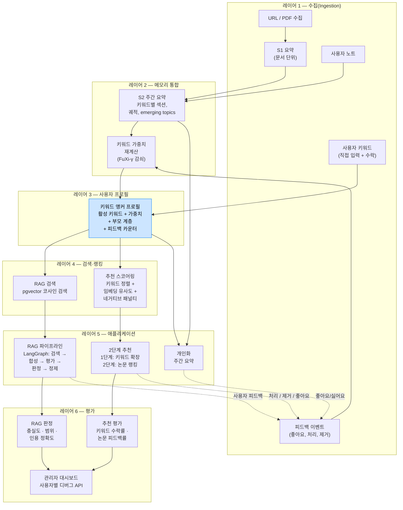
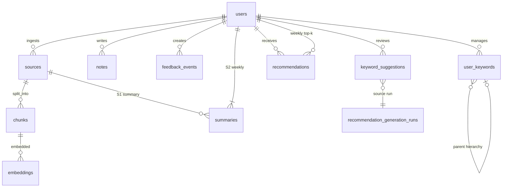

# TekLearning Agent

### 메모리 기반 개인화 학습 어시스턴트

> **"지난번에 누른 것과 비슷한 논문"이 아니라, "아직 모르지만 알아야 할 것"을 제안합니다.**

TekLearning Agent는 학술 논문·기술 아티클을 수집하고(Ingest), 개인 라이브러리 위에서 질의응답(RAG)하며, 주간 테마를 통합(S2)하고, 다음에 읽을 것을 추천하는 **엔드투엔드 학습 시스템**입니다. 전부 **진화하는 키워드 앵커 사용자 프로필** 위에서 동작합니다.

아키텍처는 의도적으로 설계되었습니다. 2단계 추천 파이프라인부터 관심 키워드의 시간 감쇠 함수까지, 모든 층은 **공개 연구**, **문서화된 트레이드오프 분석**, **명시적 설계 결정**에 연결됩니다. 이 저장소는 일반적인 프로젝트 README가 아니라 **아키텍처 백서**에 가깝습니다. 목표는 **코드 한 줄 읽지 않고도** 시스템 설계를 신뢰하게 만드는 것입니다.

**English:** [README.md](README.md)

---

## 아키텍처 개요

6개 레이어. 하나의 피드백 루프. 프로필 레이어는 RAG와 추천이 **공유하는 기판(substrate)**입니다.



**다이어그램 읽는 법**
- 실선 화살표 = 데이터 흐름(위 → 아래).
- 점선 화살표 = 피드백 루프: 사용자 행동이 레이어 1로 돌아가 **데이터 플라이휠**을 닫음.
- **프로필** 노드(파란색)는 공유 기판: RAG 검색과 추천 스코어링이 **동일한 키워드 앵커 프로필**을 참조.

---

## 핵심 가치 제안: "지도교수(Advising Professor)" 파이프라인

대부분의 추천은 "비슷한 것 더 보여주기"입니다. 이 시스템은 좋은 연구 지도교수를 모델로 합니다.

1. **무엇을 읽었는지 안다** (S1/S2 통합, 노트, 피드백 신호)
2. **새 연구 방향을 제안한다** (1단계: 키워드 확장)
3. **그 방향을 구체적 논문에 연결한다** (2단계: arXiv 검색 + 랭킹)

### 2단계 추천 파이프라인

| 단계 | 입력 | 처리 | 출력 | 사용자 행동 |
|------|------|------|------|-------------|
| **1단계 — 방향** | 활성 키워드 + S2 + 노트 + 피드백 이력 | LLM 기반 키워드 확장(주 3개: 파생, emerging, 교차 도메인) | 부모 계층 + 이유가 붙은 키워드 후보 | **수락** 또는 **거절** |
| **2단계 — 논문** | 원본 + 수락된 키워드 | arXiv 후보 수집 → 임베딩 유사도 + 키워드 정렬 − 네거티브 패널티 | 논문별 **근원 키워드**가 붙은 랭킹 목록 | **좋아요/싫어요**, **처리**(수집), **제거** |

모든 추천은 **추적 가능**합니다: "이 논문은 *graph RAG* 키워드 때문에 추천되었고, 그 키워드는 5주차에 S2 요약에 반복 등장한 graph-structured retrieval 언급을 바탕으로 제안되었으며, 사용자가 수락했습니다."

### 키워드 앵커 프로필 (프로필 = 키워드 집합)

사용자 프로필은 블랙박스 임베딩이 아닙니다. **메타데이터가 붙은 수락 키워드 집합**입니다.

```
personalized RAG   w:0.85  ★ 직접 입력    W1~
  └─ chunk reranking   w:0.72  ✓ 수락   W5~
agent memory       w:0.80  ★ 직접 입력    W1~
  └─ graph RAG         w:0.65  ✓ 수락   W3~
RAG                w:0.35  ★ 직접 입력    W1~  ⚠ 감소 중
```

관심 이동(interest drift) = 키워드 변경 이력입니다. 별도의 drift 탐지 알고리즘은 필요 없습니다. 키워드 추가·삭제·가중치 감쇠가 곧 drift 신호입니다.

---

## 설계 결정: 왜 이 구조인가

아래 각 결정은 `orchestrator/docs/`에 트레이드오프 분석과 함께 문서화되어 있습니다. 사후 정당화가 아니라 **아키텍처의 척추**입니다.

### 왜 전용 Vector DB가 아니라 PostgreSQL + pgvector인가

출처, 청크, 임베딩, 요약, 작업, 피드백, 키워드, 추천 실행 기록을 **하나의 트랜잭션 DB**에 둡니다. 운영 단순, 데이터 일관성, 프로덕션으로의 직선 경로. pgvector 인덱싱을 넘어설 때 전용 벡터 스토어가 의미가 있습니다. 현재 규모에서는 **통합 데이터 + 추적 가능성 + 추가 인프라 제로**가 우선입니다.

### 왜 S1(문서)과 S2(주간) 요약을 나누는가

**S1** = 에피소딕 압축. 문서 하나, 요약 하나, 출처에 고정. 빠르고 국소적이며 append-only.  
**S2** = 시맨틱 통합. **한 주에 걸쳐** 중요했던 것을 키워드 섹션으로 정리하고, 궤적(심화 / 신규 / 일시 정지 토픽)을 추적합니다. 한 번의 손실 압축 단계에서 단기 디테일과 장기 테마를 섞지 않기 위함입니다.

S2 v2 출력 구조: `{ tldr, bullets, sections[{keyword, insights, doc_count}], emerging_topics, connections, trajectory{deepened, new_this_week, paused}, reflection }` — 주간 요약 자체가 1단계 키워드 확장의 **구조화된 입력**이 되도록 설계했습니다.

### 왜 v1에서 바로 지식 그래프가 아니라 키워드 앵커 프로필인가

연구 로드맵(`RESEARCH_KEYWORD_TREE_AND_ROADMAP.md`)은 GraphRAG보다 **개인화 메모리와 사용자 모델링**을 먼저 둡니다. 키워드는 *시맨틱 앵커* 역할을 하고, 원시 신호(노트, 피드백, S2 빈도)는 키워드 가중치로 흘러갑니다. (6레이어 아키텍처 문서에 따르면 키워드 도입만으로 설계 결정 10개가 5개로 줄어듭니다.) 이후 관심 그래프 → 에이전틱 메모리로 확장 가능합니다.

설계 문서의 핵심 통찰: **"결정을 사용자에게 돌려주면, 시스템이 결정할 필요가 없다."** 사용자가 각 키워드를 명시적으로 수락했기 때문에 프로필 정확도는 정의상 100%입니다.

### 왜 RAG 파이프라인에 LangGraph인가

명시적이고 검사 가능한 상태 머신: 검색 → 컨텍스트 구성 → 합성 → 규칙 기반 평가 → 선택적 LLM 판정(충실도/범위/인용) → 정책 라우팅 → 정제(k 확장 또는 쿼리 재작성) → 수락 또는 폴백. 전이는 `rag_events`에 기록됩니다. **파이프라인과 실패 모드**로 사고하는 방식과 맞습니다. 단일 불투명 completion 호출이 아닙니다.

### 왜 키워드 가중치에 시간 감쇠인가

**FuXi-γ** 시간 인코더(2025)를 직접 채택: `exp(-(Δt/τ)^β)`, τ=60일, β=1.5. 사용자가 직접 입력한 키워드는 감쇠 면제(사용자가 관리). 1단계 수락 키워드는 자연 감쇠; 가중치 < 0.3이면 확인 프롬프트. 감쇠 설계에는 7편의 논문이 근거합니다 — 에빙하우스 곡선(MemoryBank, AAAI 2024)부터 메이튼(미투안) 규모 실서비스 검증(STIM, 2025)까지. 전체 서지와 v1→v2 이행 매핑은 `MEMORY_EVOLUTION_DESIGN.md` §5를 참고하세요.

---

## 추론 비용과 효율: 시스템 관점

이 프로젝트는 **토큰 예산, 지연 시간, 관측 가능성**을 1급 제약으로 둡니다. 나중에 덧붙이는 최적화가 아닙니다.

### 기능별 모델 티어링

모든 LLM 호출에 같은 모델이 필요하지 않습니다. 중앙 `llm_client.py` 팩토리가 기능별 환경 변수를 해석합니다(폴백 포함).

| 기능 | 모델 | Temperature | 이 티어를 쓰는 이유 |
|------|------|:-----------:|---------------------|
| S1 요약 | gpt-4.1 | 0.3 | 영향 큼: 읽기 요약의 형태를 결정 |
| S2 v2 통합 | gpt-4.1 | 0.4 | 영향 큼: 주간 합성이 추천을 견인 |
| 키워드 확장(1단계) | gpt-4.1 | 0.7 | 영향 큼: 연구 방향의 창의적 생성 |
| RAG 합성 | gpt-4.1-mini | 0.3 | 중간: 경계된 컨텍스트, 검색 청크에 고정 |
| RAG 판정 | gpt-4.1-mini | 0.0 | 중간: 결정적 스코어링 |
| 쿼리 재작성 | gpt-4.1-mini | 0.0 | 낮음: 좁은 범위의 재표현 |

**현재 사용량 기준 월 비용(단일 사용자, 주 약 3.5건 수집):** 티어 차등 시 약 $0.19. 전체 시뮬레이션은 `LLM_USAGE_INVENTORY_MODEL_STRATEGY.md`.

### 프로바이더 이식성

클라이트 팩토리는 동일한 OpenAI SDK 인터페이스로 OpenAI와 Gemini를 지원합니다(`base_url` 교체). 임베딩은 OpenAI(`text-embedding-3-small`, 1536차원)에 고정해 코퍼스 재임베딩을 피합니다. 채팅 완성은 코드 변경 없이 기능별로 전환 가능합니다.

### 경계된 컨텍스트, 선택적 품질 게이트

- 청크 한도(`MAX_CONTEXT_CHUNKS=12`, `MAX_CONTEXT_CHARS=12000`)로 RAG 쿼리당 최악 비용 상한.
- LLM 판정 + 정제 루프는 `JUDGE_ENABLED` 뒤에 있으며 기본값은 꺼짐 — 환경별 지연/품질 트레이드오프를 제어.
- S2 입력은 신호 유형별로 상한(S1: 10K자, 노트: 1.5K, 피드백: 1K, 이전 S2: 3K).

---

## 연구 로드맵과 서지

이 프로젝트는 **6주 구조화 문헌 조사**에 기반합니다. 임의의 프롬프트 엔지니어링이 아닙니다. 기준 지도는 `RESEARCH_KEYWORD_TREE_AND_ROADMAP.md`입니다.

### 연구 질문

> *개인 AI 학습 어시스턴트가 주간 요약, 노트, 키워드, 피드백에서 장기 사용자 메모리를 구축·활용해, 시간이 지남에 따라 개인화된 검색과 추천을 어떻게 개선할 수 있는가?*

### 주요 축과 대표 논문

| 연구 축 | 읽은 논문(예) | 직접 적용 |
|---------|---------------|-----------|
| **키워드 앵커 / 편집 가능 프로필** | LACE (SIGIR 2023), O-Mem (2025), BONSAI (2025), Folksonomy 시간 프로파일링 | D1: 프로필 = 수락 키워드 집합. 사용자 편집 → 즉시 추천 반영 |
| **키워드 확장·학습 니즈 추론** | Scholar Inbox (ACL 2025), LOOM (2025), K-LaMP (ACM Web 2024) | D2: 1단계 LLM 키워드 제안 + 부모 계층 |
| **시간적 관심 감쇠** | FuXi-γ (2025), MemoryBank (AAAI 2024), STIM (2025), Personalized Forgetting Markov (AAAI 2015) | D3: `exp(-(Δt/τ)^β)` 감쇠 함수; 7편 조사 |
| **장기·에피소딕-시맨틱 메모리** | A-MEM (2025), Memoria (2024), PersonaMem (2025) | S1/S2/노트/피드백의 층화 메모리 해석 |
| **개인화 RAG** | PersonaRAG (2024), PrLM (2025) | 프로필 조건 검색·생성(로드맵) |
| **평가** | AgentRecBench (2025), LaMP (ACL 2024), PersonaBench (2025), CiteRAG (2026) | LLM-as-judge 프롬프트, precision@k 추세, A/B 프레임워크 |

30편 이상 전체 서지, 읽음 여부, v1→v2 이행 매핑은 `MEMORY_EVOLUTION_DESIGN.md` 부록 A.

---

## 기술 스택

| 층 | 기술 |
|----|------|
| **클라이언트** | Android (Kotlin, Jetpack Compose) |
| **백엔드** | Python, FastAPI, LangGraph |
| **데이터베이스** | PostgreSQL + pgvector (Supabase 호스팅) |
| **인증** | Firebase Authentication |
| **LLM** | OpenAI (gpt-4.1 / gpt-4.1-mini), Gemini로 이식 가능 |
| **임베딩** | OpenAI text-embedding-3-small (1536차원) |
| **배포** | Google Cloud Run |
| **검색** | Semantic Scholar API, arXiv API |

---

## 저장소 구조

```
android/                    Android 클라이언트 (Kotlin / Jetpack Compose)
  app/src/main/java/.../
    ui/screens/             피드, Ask(RAG), 추천, 온보딩
    data/remote/            API 클라이언트 (수집, RAG, 피드백)
    data/repository/        리포지토리 + OnboardingPrefs

orchestrator/               FastAPI 백엔드
  app/
    main.py                 라우터 연결 (18개)
    graphs/rag_graph.py     LangGraph RAG 파이프라인 (~1300줄)
    services/
      keyword_expansion.py  1단계: LLM 키워드 제안
      s2_consolidation.py   S2 주간 통합 (v1/v2)
      rag_service.py        레거시 RAG 경로
      arxiv_recommendations.py  2단계: arXiv 검색 + 스코어링
    rag/nodes/              judge.py, policy.py, refine_plan.py, rewrite_query.py
    utils/
      llm_client.py         중앙 LLM 팩토리 (프로바이더 + 모델 라우팅)
      summarization.py      S1/S2 프롬프트 구성 + 파싱
      embeddings.py         임베딩 클라이언트 (OpenAI)
    db/repo.py              데이터 접근 (Supabase/Postgres)
    routers/                18개 라우트 모듈 (수집, rag, 피드백, 키워드, 관리자, …)
    worker/job_runner.py    비동기 작업 처리 (수집, S2, 1·2단계)

  docs/                     아키텍처·제품 설계 (문서 50개 이상)
    PERSONALIZED_MEMORY_ARCHITECTURE_DRAFT.md   6레이어 목표 아키텍처
    MEMORY_EVOLUTION_DESIGN.md                  2단계 파이프라인 심화 + 서지
    LLM_USAGE_INVENTORY_MODEL_STRATEGY.md       LLM 호출 10곳, 프롬프트, 비용
    RESEARCH_KEYWORD_TREE_AND_ROADMAP.md        문헌 조사 + 6주 연구 계획
    EVALUATION_BENCHMARKS_AND_STRATEGY.md       학술 벤치마크 + 평가 프롬프트
    LAUNCH_STRATEGY_AND_REVENUE_MODEL.md        VC vs 인디, 프리미엄, 비용
    CAREER_POSITIONING.md                       스택 갭·브랜딩 전략

  sql/                      스키마 마이그레이션 (00–55)
    10_schema_core.sql      users, sources, chunks, embeddings, summaries
    52_schema_recommendations.sql  recommendations 테이블
    53_schema_alpha_feedback_memory.sql  notes, feedback_events, user_keywords,
                                         keyword_suggestions, recommendation_generation_runs
```

---

## 데이터 모델 (요약)



---

## 로컬 실행

전체 설정은 **[`docs/README.md`](docs/README.md)** 를 참고하세요: Python 3.8+, `.env`(OpenAI, Supabase, Firebase), `uvicorn app.main:app --reload`, health·수집·RAG용 `curl` 예시.

---

## 상태

**클로즈드 알파** — 엔드투엔드 파이프라인 가동 중 (수집 → S1 → RAG → S2 → 1단계 키워드 확장 → 2단계 논문 추천 → 피드백 루프). 현재 **Android 전용**, 단일 사용자 운영 모델.

### 구현·가동 중인 것

- URL/PDF 수집 및 S1 요약 (HTML + PDF 최대 100페이지)
- 개인 라이브러리 RAG, LangGraph 파이프라인 (평가/판정/정제 루프)
- S2 v2 주간 통합 (키워드별 섹션 + 궤적)
- 2단계 추천 파이프라인 (키워드 확장 + arXiv 논문 랭킹)
- 키워드 앵커 프로필 (수락/거절, 부모 계층, 가중치 감쇠)
- 피드백 이벤트(좋아요/싫어요, 처리, 제거) 전체 감사 추적
- 사용자별 디버그·피드백 대시보드·평가용 관리자 API
- SQL 마이그레이션 55개, 아키텍처 문서 50개 이상

### 로드맵

| 단계 | 초점 |
|------|------|
| **현재** | 클로즈드 알파 운영, precision@3 측정, 키워드 수락률 추적 |
| **다음** | 프로필 조건 RAG 검색, 추천 정제 루프(Option C), 평가 자동화 |
| **이후** | 관심 그래프(`memory_entities` / `memory_edges`), 그래프 인지 검색, 에이전틱 메모리 |

---

## 배경: 실리콘에서 UX까지

이 프로젝트는 **GPU 소프트웨어 개발 VP**가 만들었습니다. 본업은 GPU 하드웨어 아키텍처, 드라이버·컴파일러 스택(Triton, ROCm, CUDA), 대규모 SW/HW 공동 설계입니다.

AI 애플리케이션을 엔드투엔드로 직접 만든 것은 "AI 전문가"가 되기 위함이 아니라, **컴퓨트 기판이 제품 수준 AI 워크로드에서 실제로 어떻게 소비되는지** — 임베딩 비용 패턴부터 파이프라인 아키텍처를 형성하는 지연 예산까지 — 경험하기 위함입니다. 경계된 컨텍스트, 차등 모델 티어링, 명시적 상태 머신, 작업 기반 배치 처리 같은 시스템 사고는 **스택의 다른 층에 적용한 하드웨어 아키텍처 훈련**에서 옵니다.

6주 연구 로드맵, 30편 이상 문헌 조사, 문서화된 설계 결정은 하드웨어 아키텍트가 새 도메인에 접근하는 방식입니다: **체계적으로, 모든 분기점에서 추적 가능한 근거를 남기며.**

---

## 내부 문서 색인

더 깊이 들어가려면 여기서 시작하세요.

| 문서 | 내용 |
|------|------|
| [`PERSONALIZED_MEMORY_ARCHITECTURE_DRAFT.md`](orchestrator/docs/PERSONALIZED_MEMORY_ARCHITECTURE_DRAFT.md) | 6레이어 목표 아키텍처, 현재 vs 목표, 단계별 구현 계획 |
| [`MEMORY_EVOLUTION_DESIGN.md`](orchestrator/docs/MEMORY_EVOLUTION_DESIGN.md) | 2단계 파이프라인 심화, 설계 결정 5개, 키워드 확장 알고리즘, 감쇠 함수, 서지(30편+) |
| [`LLM_USAGE_INVENTORY_MODEL_STRATEGY.md`](orchestrator/docs/LLM_USAGE_INVENTORY_MODEL_STRATEGY.md) | LLM 호출 10곳 전체 프롬프트, 모델 비교표, 비용 시뮬레이션, Gemini 이전 가이드 |
| [`RESEARCH_KEYWORD_TREE_AND_ROADMAP.md`](orchestrator/docs/RESEARCH_KEYWORD_TREE_AND_ROADMAP.md) | 문헌 조사: 연구 축 5개, 키워드 트리, 6주 독서 계획 |
| [`EVALUATION_BENCHMARKS_AND_STRATEGY.md`](orchestrator/docs/EVALUATION_BENCHMARKS_AND_STRATEGY.md) | 학술 벤치마크(LaMP, PersonaMem 등), LLM-as-judge, 온라인 지표 |
| [`LAUNCH_STRATEGY_AND_REVENUE_MODEL.md`](orchestrator/docs/LAUNCH_STRATEGY_AND_REVENUE_MODEL.md) | VC vs 인디 분석, 프리미엄, 비용 전망 |
| [`MARKET_COMPARISON_PM_VC.md`](orchestrator/docs/MARKET_COMPARISON_PM_VC.md) | Readwise, Elicit, Mem, Matter 등과 기능 비교 |

---

## 라이선스

*[추가 예정]*
