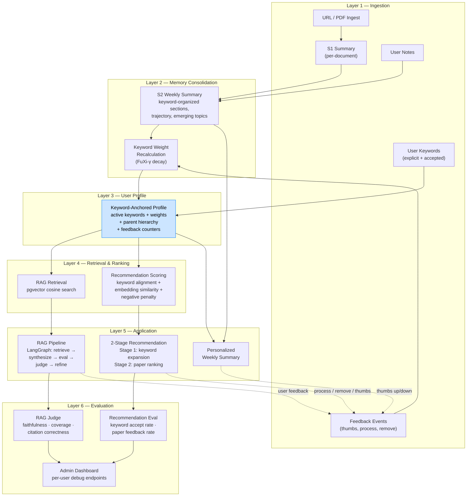
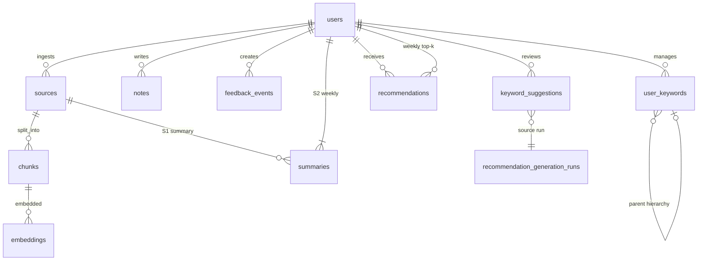

# TekLearning Agent

**한국어:** [README.ko.md](README.ko.md)

### A Memory-Driven Personalized Learning Assistant

> **Not "papers similar to your last click" — but "what you don't yet know, but should."**

TekLearning Agent is a solo-built, end-to-end learning system that ingests academic papers and technical articles, answers questions over your personal library (RAG), consolidates weekly themes, and recommends what to read next — all driven by an evolving keyword-anchored user profile.

The architecture is deliberate: every layer — from the two-stage recommendation pipeline to the time-decay function on interest keywords — traces back to published research, documented trade-off analysis, and explicit design decisions. This repository is structured as an **architecture whitepaper**, not a typical project README: the goal is for the reader to trust the system design without reading a single line of code.

---

## Architecture Overview

Six layers. One feedback loop. The profile layer is the substrate that both RAG and recommendations share.



**How to read this diagram:**
- Solid arrows = data flow (top → bottom).
- Dashed arrows = feedback loop: user actions flow back into Layer 1, closing the data flywheel.
- The **Profile** node (blue) is the shared substrate: both RAG retrieval and recommendation scoring reference the same keyword-anchored profile.

---

## Core Value Proposition: The "Advising Professor" Pipeline

Most recommendation systems show you "more of the same." This system is modeled after a good research advisor who:

1. **Knows what you've been reading** (S1/S2 consolidation, notes, feedback signals)
2. **Suggests new research directions** (Stage 1: keyword expansion)
3. **Grounds those directions in specific papers** (Stage 2: arXiv search + ranking)

### Two-Stage Recommendation Pipeline

| Stage | Input | Process | Output | User Action |
|-------|-------|---------|--------|-------------|
| **Stage 1 — Direction** | Active keywords + S2 + notes + feedback history | LLM-based keyword expansion (3 suggestions/week: derivative, emerging, cross-domain) | New keyword candidates with parent hierarchy + reason | **Accept** or **Reject** |
| **Stage 2 — Papers** | Original + accepted keywords | arXiv candidate fetch → embedding similarity + keyword alignment − negative penalty | Ranked paper list with per-paper source-keyword attribution | **Thumbs up/down**, **Process** (ingest), **Remove** |

Every recommendation is **traceable**: "This paper was recommended because of keyword *graph RAG*, which was suggested in Week 5 based on repeated mentions of graph-structured retrieval in your S2 summaries, and you accepted it."

### Keyword-Anchored Profile (the Profile = the Keywords)

The user profile is not a black-box embedding. It is the **set of accepted keywords with metadata**:

```
personalized RAG   w:0.85  ★ explicit    since W1
  └─ chunk reranking   w:0.72  ✓ accepted   since W5
agent memory       w:0.80  ★ explicit    since W1
  └─ graph RAG         w:0.65  ✓ accepted   since W3
RAG                w:0.35  ★ explicit    since W1  ⚠ declining
```

Interest drift = keyword change history. No separate drift-detection algorithm needed — keyword additions, deletions, and weight decay *are* the drift signal.

---

## Design Decisions: Why This Shape

Each decision below is documented with trade-off analysis in `orchestrator/docs/`. These are not afterthoughts; they are the architectural spine.

### Why PostgreSQL + pgvector, not a dedicated vector DB?

One operational store for sources, chunks, embeddings, summaries, jobs, feedback, keywords, and recommendation runs — in a single transactional database. Simpler ops, consistent data, a straight path to production. A dedicated vector store makes sense when you outgrow pgvector's indexing; at this scale the priority is **unified data + traceability + zero extra infrastructure**.

### Why separate S1 (document) and S2 (weekly) summaries?

**S1** = episodic compression. One document, one summary, tied to the source. Fast, local, append-only.  
**S2** = semantic consolidation. What mattered *across the week*, organized by keyword sections, with trajectory tracking (deepened / new / paused topics). Splitting avoids collapsing short-term detail into long-term themes in a single lossy step.

S2 v2 output structure: `{ tldr, bullets, sections[{keyword, insights, doc_count}], emerging_topics, connections, trajectory{deepened, new_this_week, paused}, reflection }` — designed so the weekly summary itself becomes a structured input to Stage 1 keyword expansion.

### Why keyword-anchored profile (v1) rather than a knowledge graph immediately?

The research roadmap (`RESEARCH_KEYWORD_TREE_AND_ROADMAP.md`) explicitly prioritizes **personalized memory and user modeling** before GraphRAG. Keywords act as *semantic anchors* — raw signals (notes, feedback, S2 frequency) feed into keyword weights. This reduces premature complexity (the 6-layer architecture doc shows that introducing keywords collapses 10 design decisions into 5) while remaining compatible with richer memory structures later (interest graph → agentic memory).

The key insight from the design docs: **"Give the decision back to the user, and the system doesn't need to decide."** Profile accuracy is definitionally 100% because the user explicitly accepted each keyword.

### Why LangGraph for the RAG pipeline?

Explicit, inspectable state machine: retrieve → build context → synthesize → rule-based eval → optional LLM judge (faithfulness/coverage/citation) → policy route → refine (expand k or rewrite query) → accept or fallback. Each transition is logged to `rag_events`. This matches how you reason about **pipelines and failure modes** — not a single opaque completion call.

### Why time-decay on keyword weights?

Directly adopted from the **FuXi-γ** temporal encoder (2025): `exp(-(Δt/τ)^β)` with τ=60 days, β=1.5. User-explicit keywords are decay-exempt (the user manages them). Stage-1-accepted keywords decay naturally; weight < 0.3 triggers a confirmation prompt. Seven papers inform the decay design — from Ebbinghaus curves (MemoryBank, AAAI 2024) to Meituan-scale production validation (STIM, 2025). See `MEMORY_EVOLUTION_DESIGN.md` §5 for the full bibliography and v1→v2 migration mapping.

---

## Inference Cost and Efficiency: A Systems View

This project is built with the mindset that **token budget, latency, and observability are first-class constraints** — not afterthoughts optimized later.

### Per-function model tiering

Not every LLM call needs the same model. A central `llm_client.py` factory resolves per-function environment variables with fallback:

| Function | Model | Temperature | Why this tier |
|----------|-------|:-----------:|---------------|
| S1 summary | gpt-4.1 | 0.3 | High-impact: shapes the user's reading digest |
| S2 v2 consolidation | gpt-4.1 | 0.4 | High-impact: weekly synthesis drives recommendations |
| Keyword expansion (Stage 1) | gpt-4.1 | 0.7 | High-impact: creative generation of research directions |
| RAG synthesis | gpt-4.1-mini | 0.3 | Mid-impact: bounded context, grounded in retrieved chunks |
| RAG judge | gpt-4.1-mini | 0.0 | Mid-impact: deterministic scoring |
| Query rewrite | gpt-4.1-mini | 0.0 | Low-impact: narrow reformulation |

**Monthly cost at current usage (single user, ~3.5 ingests/week):** ~$0.19 with differential tiering. Full simulation in `LLM_USAGE_INVENTORY_MODEL_STRATEGY.md`.

### Provider portability

The client factory supports OpenAI and Gemini via the same OpenAI SDK interface (`base_url` swap). Embeddings stay on OpenAI (`text-embedding-3-small`, 1536d) to avoid re-embedding the corpus. Chat completions can be switched per-function without code changes.

### Bounded context, optional quality gates

- Chunk limits (`MAX_CONTEXT_CHUNKS=12`, `MAX_CONTEXT_CHARS=12000`) cap worst-case cost per RAG query.
- The LLM judge + refine loop is behind `JUDGE_ENABLED` — turned off by default so you control the latency/quality trade-off per environment.
- S2 input windows are capped per signal type (S1: 10K chars, notes: 1.5K, feedback: 1K, previous S2: 3K).

---

## Research Roadmap and Bibliography

This project is grounded in a **6-week structured literature review**, not ad-hoc prompt engineering. The canonical map lives in `RESEARCH_KEYWORD_TREE_AND_ROADMAP.md`.

### Research question

> *How can a personal AI learning assistant build and use long-term user memory from weekly summaries, notes, keywords, and feedback to improve personalized retrieval and recommendation over time?*

### Key threads and representative papers

| Research Thread | Papers Read | Direct Application |
|----------------|-------------|-------------------|
| **Keyword-anchored / editable profiles** | LACE (SIGIR 2023), O-Mem (2025), BONSAI (2025), Folksonomy temporal profiling | D1: profile = accepted keyword set. User edits → immediate recommendation update |
| **Keyword expansion & learning-needs inference** | Scholar Inbox (ACL 2025), LOOM (2025), K-LaMP (ACM Web 2024) | D2: Stage 1 LLM-based keyword suggestion with parent hierarchy |
| **Temporal interest decay** | FuXi-γ (2025), MemoryBank (AAAI 2024), STIM (2025), Personalized Forgetting Markov (AAAI 2015) | D3: `exp(-(Δt/τ)^β)` decay function; 7 papers surveyed |
| **Long-term / episodic-semantic memory** | A-MEM (2025), Memoria (2024), PersonaMem (2025) | Layered memory interpretation of S1/S2/notes/feedback |
| **Personalized RAG** | PersonaRAG (2024), PrLM (2025) | Profile-conditioned retrieval and generation (roadmap) |
| **Evaluation** | AgentRecBench (2025), LaMP (ACL 2024), PersonaBench (2025), CiteRAG (2026) | LLM-as-judge prompts, precision@k trending, A/B framework |

Full bibliography with 30+ papers, reading status, and v1→v2 migration mapping in `MEMORY_EVOLUTION_DESIGN.md` Appendix A.

---

## Technology Stack

| Layer | Technology |
|-------|-----------|
| **Client** | Android (Kotlin, Jetpack Compose) |
| **Backend** | Python, FastAPI, LangGraph |
| **Database** | PostgreSQL + pgvector (hosted on Supabase) |
| **Auth** | Firebase Authentication |
| **LLM** | OpenAI (gpt-4.1 / gpt-4.1-mini), portable to Gemini |
| **Embeddings** | OpenAI text-embedding-3-small (1536d) |
| **Deployment** | Google Cloud Run |
| **Search** | Semantic Scholar API, arXiv API |

---

## Repository Layout

```
android/                    Android client (Kotlin / Jetpack Compose)
  app/src/main/java/.../
    ui/screens/             Feed, Ask (RAG), Recommendations, Onboarding
    data/remote/            API clients (Ingest, RAG, Feedback)
    data/repository/        Repository layer + OnboardingPrefs

orchestrator/               FastAPI backend
  app/
    main.py                 Router wiring (18 routers)
    graphs/rag_graph.py     LangGraph RAG pipeline (~1300 lines)
    services/
      keyword_expansion.py  Stage 1: LLM keyword suggestion
      s2_consolidation.py   S2 weekly consolidation (v1/v2)
      rag_service.py        Legacy RAG path
      arxiv_recommendations.py  Stage 2: arXiv search + scoring
    rag/nodes/              judge.py, policy.py, refine_plan.py, rewrite_query.py
    utils/
      llm_client.py         Central LLM factory (provider + model routing)
      summarization.py      S1/S2 prompt construction + parsing
      embeddings.py         Embedding client (OpenAI)
    db/repo.py              Data access (Supabase/Postgres)
    routers/                18 route modules (ingest, rag, feedback, keywords, admin, ...)
    worker/job_runner.py    Async job processing (ingest, S2, Stage 1/2)

  docs/                     Architecture & product design (50+ documents)
    PERSONALIZED_MEMORY_ARCHITECTURE_DRAFT.md   6-layer target architecture
    MEMORY_EVOLUTION_DESIGN.md                  2-Stage Pipeline deep dive + bibliography
    LLM_USAGE_INVENTORY_MODEL_STRATEGY.md       All 10 LLM call sites, prompts, costs
    RESEARCH_KEYWORD_TREE_AND_ROADMAP.md        Literature review + 6-week research plan
    EVALUATION_BENCHMARKS_AND_STRATEGY.md       Academic benchmarks + eval prompts
    LAUNCH_STRATEGY_AND_REVENUE_MODEL.md        VC vs indie positioning + revenue model
    CAREER_POSITIONING.md                       Stack gap analysis + branding strategy

  sql/                      Schema migrations (00–55)
    10_schema_core.sql      users, sources, chunks, embeddings, summaries
    52_schema_recommendations.sql  recommendations table
    53_schema_alpha_feedback_memory.sql  notes, feedback_events, user_keywords,
                                         keyword_suggestions, recommendation_generation_runs
```

---

## Data Model (Simplified)



---

## Running Locally

See **[`docs/README.md`](docs/README.md)** for full setup instructions: Python 3.8+, `.env` configuration (OpenAI, Supabase, Firebase), `uvicorn app.main:app --reload`, and example `curl` calls for health, ingest, and RAG endpoints.

---

## Status

**Closed Alpha** — end-to-end pipeline running (Ingest → S1 → RAG → S2 → Stage 1 keyword expansion → Stage 2 paper recommendations → feedback loop). Currently Android-only with a single-user operational model.

### What is built and running

- URL/PDF ingest with S1 summarization (HTML + PDF up to 100 pages)
- RAG over personal library with LangGraph pipeline (eval/judge/refine loop)
- S2 v2 weekly consolidation (keyword-organized sections + trajectory)
- 2-Stage recommendation pipeline (keyword expansion + arXiv paper ranking)
- Keyword-anchored profile with accept/reject, parent hierarchy, weight decay
- Feedback events (thumbs up/down, process, remove) with full audit trail
- Admin endpoints for per-user debug, feedback dashboard, evaluation
- 55 SQL migration files, 50+ architecture documents

### Roadmap

| Phase | Focus |
|-------|-------|
| **Current** | Closed alpha operation, precision@3 measurement, keyword accept-rate tracking |
| **Next** | Profile-conditioned RAG retrieval, recommendation refine loop (Option C), evaluation automation |
| **Later** | Interest graph (`memory_entities` / `memory_edges`), graph-aware retrieval, agentic memory |

---

## Background: From Silicon to UX

This project was built by a **VP of GPU Software Development** — someone whose day job is GPU hardware architecture, driver/compiler stacks (Triton, ROCm, CUDA), and SW/HW co-design at scale.

The deliberate choice to build an AI application end-to-end was not to become an "AI expert," but to experience **how the compute substrate actually gets consumed by product-level AI workloads** — from embedding cost patterns to the latency budgets that shape pipeline architecture. The systems-level thinking (bounded contexts, differential model tiering, explicit state machines, job-based batch processing) comes directly from hardware architecture discipline applied to a different layer of the stack.

The 6-week research roadmap, 30+ paper literature review, and documented design decisions are how a hardware architect approaches a new domain: **systematically, with traceable rationale at every branch point.**

---

## Internal Documentation Index

For readers who want to go deeper, start here:

| Document | What it covers |
|----------|---------------|
| [`PERSONALIZED_MEMORY_ARCHITECTURE_DRAFT.md`](orchestrator/docs/PERSONALIZED_MEMORY_ARCHITECTURE_DRAFT.md) | 6-layer target architecture, current vs target comparison, phased implementation plan |
| [`MEMORY_EVOLUTION_DESIGN.md`](orchestrator/docs/MEMORY_EVOLUTION_DESIGN.md) | 2-Stage Pipeline deep dive, 5 design decisions, keyword expansion algorithm, decay function, bibliography (30+ papers) |
| [`LLM_USAGE_INVENTORY_MODEL_STRATEGY.md`](orchestrator/docs/LLM_USAGE_INVENTORY_MODEL_STRATEGY.md) | All 10 LLM call sites with full prompts, model comparison tables, cost simulations, Gemini migration guide |
| [`RESEARCH_KEYWORD_TREE_AND_ROADMAP.md`](orchestrator/docs/RESEARCH_KEYWORD_TREE_AND_ROADMAP.md) | Literature review: 5 research threads, keyword tree, 6-week reading plan |
| [`EVALUATION_BENCHMARKS_AND_STRATEGY.md`](orchestrator/docs/EVALUATION_BENCHMARKS_AND_STRATEGY.md) | Academic benchmarks (LaMP, PersonaMem, AgentRecBench), LLM-as-judge prompts, online metrics |
| [`LAUNCH_STRATEGY_AND_REVENUE_MODEL.md`](orchestrator/docs/LAUNCH_STRATEGY_AND_REVENUE_MODEL.md) | VC vs indie analysis, freemium model, cost projections |
| [`MARKET_COMPARISON_PM_VC.md`](orchestrator/docs/MARKET_COMPARISON_PM_VC.md) | Feature comparison vs Readwise, Elicit, Mem, Matter |

---

## License

*[TBD]*
