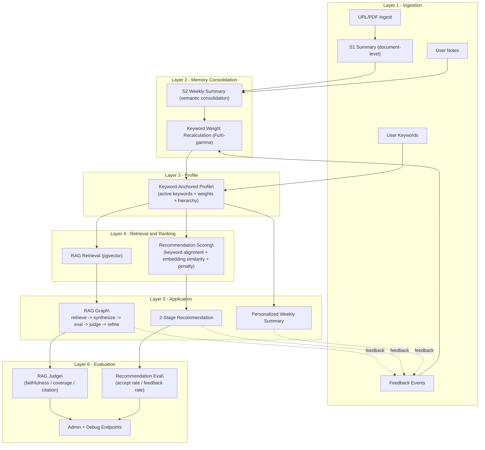

# My Learning Agent

**A Memory-Driven Personalized Learning Assistant**

> A personalized learning assistant that compounds over time:  
> **Ingest → S1 → RAG → S2 → Stage-1 Keyword Direction → Stage-2 Paper Recommendation → Feedback Flywheel**

**Full README (KO):** [README.ko.md](README.ko.md)

---

## Executive Summary

MyLearningAgent is not a generic AI wrapper.  
It is a system-level architecture for long-horizon personalization: your reading history, notes, and feedback are consolidated into a keyword-anchored profile that improves retrieval and recommendation week after week.

This document is intentionally written as an architecture whitepaper so engineering leaders can evaluate whether the internals are coherent, whether trade-offs are explicit, and whether the learning-trajectory thesis is credible without reading application code.

---

## Why This Matters

Most AI reading tools optimize for short-term convenience (“summarize this document”).  
This system optimizes for learning trajectory (“how does this user’s research direction evolve over time?”).

The core bet:

1. Structured memory beats stateless chat for sustained learning.
2. Keyword-anchored profiles beat opaque black-box personalization for controllability.
3. Traceable recommendation logic beats similarity-only ranking for trust and iteration speed.

---

## High-Level Architecture

---

## Core Technical Value Prop: “Advising Professor” Pipeline

Most recommendation systems show you “more of the same.” This system is modeled after a good research advisor who:

1. **Knows what you’ve been reading** (S1/S2 consolidation, notes, feedback signals)
2. **Suggests new research directions** (Stage 1: keyword expansion)
3. **Grounds those directions in specific papers** (Stage 2: arXiv search + ranking)

### Two-Stage Recommendation Pipeline

| Stage | Input | Process | Output | User Action |
|-------|-------|---------|--------|-------------|
| **Stage 1 — Direction** | Active keywords + S2 + notes + feedback history | LLM-based keyword expansion (3 suggestions/week: derivative, emerging, cross-domain) | New keyword candidates with parent hierarchy + reason | **Accept** or **Reject** |
| **Stage 2 — Papers** | Original + accepted keywords | arXiv candidate fetch → embedding similarity + keyword alignment − negative penalty | Ranked paper list with per-paper source-keyword attribution | **Thumbs up/down**, **Process** (ingest), **Remove** |

Every recommendation is **traceable**, **explainable**, and **user-controllable**—for example: “This paper was recommended because of keyword *graph RAG*, suggested in Week 5 from repeated graph-structured retrieval mentions in your S2 summaries, which you accepted.”

---

## Why This Architecture (Design Decisions)

### 1) Why PostgreSQL + pgvector (instead of a separate vector DB)?

One transactional system for sources, chunks, vectors, summaries, jobs, feedback, and profile metadata.  
At current scale, operational simplicity and data coherence outperform multi-store complexity.

### 2) Why split S1 and S2?

- S1 captures per-document episodic compression.
- S2 performs weekly semantic consolidation and trajectory tracking.

This separation prevents short-term noise from polluting long-term profile updates.

### 3) Why keyword-anchored profile first (before full GraphRAG)?

Graph-first introduces schema and maintenance complexity too early.  
Keyword anchors provide explicit control now while preserving a migration path to richer memory graphs later.

### 4) Why LangGraph-style RAG flow?

Explicit state transitions (retrieve / eval / judge / refine) improve observability, reliability, and debugging versus one-shot opaque calls.

### 5) Why temporal decay?

Interests are non-stationary.  
Using `exp(-(delta_t/tau)^beta)` (FuXi-gamma) lets profile weights adapt over time while preserving user-explicit keywords as stable anchors.

---

## Inference Cost and Efficiency (A Hardware Architect’s Lens)

This system treats latency, token budget, and failure modes as first-class constraints:

- Differential model routing by function (`S1` / `S2` / keyword expansion: higher tier; `RAG` synthesis / judge / rewrite: mid tier)
- Bounded context windows (`MAX_CONTEXT_CHUNKS`, `MAX_CONTEXT_CHARS`)
- Optional judge/refine gating (`JUDGE_ENABLED`) to tune quality–cost tradeoffs by environment
- Provider portability (OpenAI / Gemini for chat; stable embedding strategy to avoid re-embedding churn)

See [`orchestrator/docs/LLM_USAGE_INVENTORY_MODEL_STRATEGY.md`](docs/LLM_USAGE_INVENTORY_MODEL_STRATEGY.md).

---

## Research-to-Product Roadmap

Research question:  
How can a personal AI learning assistant build long-term user memory from weekly summaries, notes, keywords, and feedback to improve personalized retrieval and recommendation over time?

Core research threads applied:

- Editable profile modeling: LACE, O-Mem
- Keyword expansion and learning-needs inference: Scholar Inbox, LOOM, K-LaMP
- Temporal preference dynamics: FuXi-gamma, MemoryBank, STIM
- Personalized RAG: PersonaRAG, PrLM
- Evaluation frameworks: AgentRecBench, LaMP, PersonaBench, CiteRAG

Full bibliography and decision log: [`docs/MEMORY_EVOLUTION_DESIGN.md`](docs/MEMORY_EVOLUTION_DESIGN.md).

---

## Current Status

**Closed Alpha**

Implemented and running:

- URL/PDF ingest + S1 summaries
- RAG graph pipeline with evaluation/refinement
- S2 weekly consolidation (v2 schema)
- Two-stage recommendation flow
- Keyword profile lifecycle (accept/reject/decay/hierarchy)
- Feedback event logging + admin/debug endpoints

---

## Local Setup

See [`docs/README.md`](docs/README.md) for Python, `.env`, `uvicorn`, and example `curl` calls (health, ingest, RAG).

---

## Documentation Map

| Document | Description |
|----------|-------------|
| [`PERSONALIZED_MEMORY_ARCHITECTURE_DRAFT.md`](docs/PERSONALIZED_MEMORY_ARCHITECTURE_DRAFT.md) | Target 6-layer architecture, current vs target, phased plan |
| [`MEMORY_EVOLUTION_DESIGN.md`](docs/MEMORY_EVOLUTION_DESIGN.md) | Two-stage pipeline deep dive, design decisions, bibliography |
| [`LLM_USAGE_INVENTORY_MODEL_STRATEGY.md`](docs/LLM_USAGE_INVENTORY_MODEL_STRATEGY.md) | LLM call sites, prompts, cost, provider migration |
| [`RESEARCH_KEYWORD_TREE_AND_ROADMAP.md`](docs/RESEARCH_KEYWORD_TREE_AND_ROADMAP.md) | Literature map + research roadmap |
| [`EVALUATION_BENCHMARKS_AND_STRATEGY.md`](docs/EVALUATION_BENCHMARKS_AND_STRATEGY.md) | Benchmarks, LLM-as-judge, online metrics |
| [`LAUNCH_STRATEGY_AND_REVENUE_MODEL.md`](docs/LAUNCH_STRATEGY_AND_REVENUE_MODEL.md) | Go-to-market and revenue framing |
| [`MARKET_COMPARISON_PM_VC.md`](docs/MARKET_COMPARISON_PM_VC.md) | Product comparison vs adjacent tools |

---

## License

TBD
