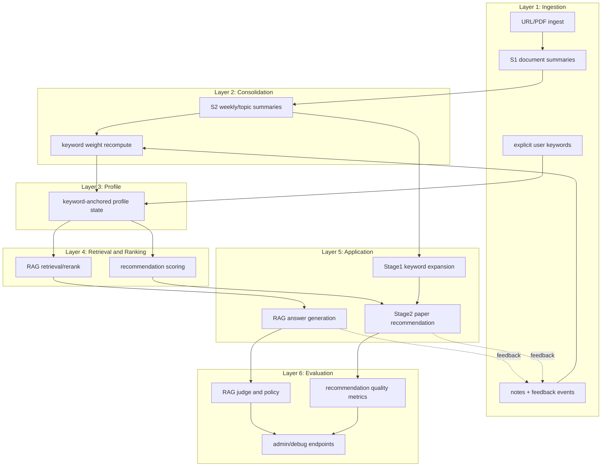

# TekLearning Agent Architecture

This document consolidates implementation and design docs into a single architecture view.
It is intended for engineers and architects evaluating system internals.

---

## 1) Architecture Thesis

TekLearning Agent is a memory-driven personalization system.
The core objective is not just "answer this query," but:
- track user interest evolution over time,
- expose recommendation rationale,
- and improve retrieval/recommendation quality through feedback loops.

---

## 2) Layered System Model

---

## 3) Pipeline Semantics

### Ingest -> S1
- Input assets: URLs, PDFs
- Core outputs:
  - `sources`
  - `chunks`
  - `embeddings`
  - S1 rows in `summaries`

### S1 -> S2
- Weekly/topic consolidation generates S2 in `summaries` (`scope='topic'`, `kind='S2'`)
- S2 is used as semantic memory context for recommendation and profile update

### 2-Stage Recommendation
- Stage 1 (`keyword_expansion.py`):
  - LLM proposes 3 keywords from active profile + recent S2 + notes
  - Output stored in `keyword_suggestions`
- Stage 2 (`arxiv_recommendations.py`):
  - Uses original + accepted keywords
  - ranks candidates by embedding similarity + alignment + penalty
  - persists to `recommendations`

### Feedback Loop
- User actions (`thumbs_up/down`, `process`, `remove`, etc.) go to `feedback_events`
- Signals update keyword profile state and future retrieval/ranking

---

## 4) RAG Architecture (Graph-Based)

Reference implementation: `orchestrator/app/graphs/rag_graph.py`

High-level state flow:
1. Embed query
2. Retrieve chunks (pgvector)
3. Build bounded context
4. Synthesize answer with citations
5. Rule-based eval checks
6. Optional LLM judge (`JUDGE_ENABLED`)
7. Policy route (accept or refine)
8. Refine by expanding K or rewriting query
9. Fallback when answerability conditions fail

Observability:
- run and event logging in `rag_runs` / `rag_events` (optional schema support)

---

## 5) Data Model and Tables

Core:
- `users`
- `sources`
- `chunks`
- `embeddings`
- `summaries`

Memory/recommendation:
- `notes`
- `feedback_events`
- `recommendations`
- `user_keywords`
- `keyword_suggestions`
- `recommendation_generation_runs`

Optional snapshot:
- `user_interest_profiles`

Schemas:
- `orchestrator/sql/10_schema_core.sql`
- `orchestrator/sql/52_schema_recommendations.sql`
- `orchestrator/sql/53_schema_alpha_feedback_memory.sql`

---

## 6) Key Design Decisions

1. **Unified transactional backbone (Postgres + pgvector)**  
   Minimize cross-store consistency complexity in early/mid stage.

2. **S1/S2 separation**  
   Preserve episodic granularity while enabling semantic weekly consolidation.

3. **Keyword-anchored profile (v1)**  
   Prioritize controllable, explainable personalization before graph-heavy modeling.

4. **Graph-orchestrated RAG**  
   Explicit state transitions and policy control for production debugging.

5. **Temporal keyword decay**  
   Model non-stationary interests with interpretable signal dynamics.

---

## 7) Performance and Cost Controls

- Context limits for RAG (`MAX_CONTEXT_CHUNKS`, `MAX_CONTEXT_CHARS`)
- Differential model routing by function
- Optional LLM judge/refine loop
- Provider portability for chat models
- Stable embedding model to avoid re-embedding churn

See: `orchestrator/docs/LLM_USAGE_INVENTORY_MODEL_STRATEGY.md`

---

## 8) Evaluation Strategy

Current:
- RAG-side rule and judge-based quality checks

Planned parity:
- Recommendation-side LLM-as-judge hooks
- Weekly trend metrics (accept rate, precision trend)
- A/B baseline vs personalized comparison

See:
- `orchestrator/docs/EVALUATION_BENCHMARKS_AND_STRATEGY.md`
- `orchestrator/docs/PERSONALIZED_MEMORY_ARCHITECTURE_DRAFT.md`

---

## 9) Evolution Path

Near term:
- strengthen profile-conditioned retrieval/ranking
- add recommendation refine loop

Mid term:
- expand explainability artifacts
- unify evaluation surfaces

Long term:
- interest graph (`memory_entities`, `memory_edges`)
- graph-aware retrieval
- agentic memory maintenance

---

## 10) Primary References

- `orchestrator/docs/PERSONALIZED_MEMORY_ARCHITECTURE_DRAFT.md`
- `orchestrator/docs/MEMORY_EVOLUTION_DESIGN.md`
- `orchestrator/docs/RESEARCH_KEYWORD_TREE_AND_ROADMAP.md`
- `orchestrator/docs/LAUNCH_STRATEGY_AND_REVENUE_MODEL.md`
