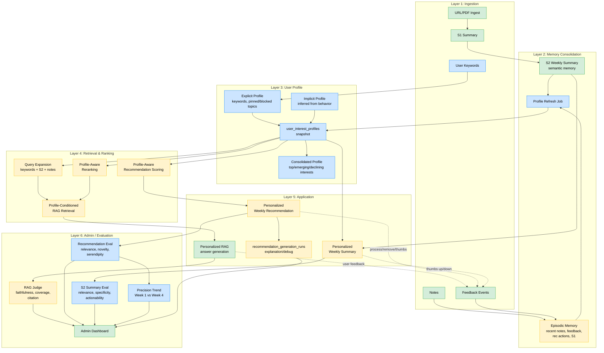

# Personalized Memory Architecture Draft

**목적:** 현재 Learning Assistant를 `document-centric RAG`에서, `weekly summary + notes + explicit keyword + feedback`를 바탕으로 시간이 지날수록 더 개인화되는 **memory-driven learning assistant**로 고도화하기 위한 시스템 아키텍처 초안을 정리한다.  
**전제:** 이 문서는 현재 구현된 Android + FastAPI + Postgres/Supabase 구조를 최대한 활용하는 방향을 우선한다. 즉, 전면 재작성보다 **점진적 확장**을 기준으로 한다.

> **📌 2026-03-21 Update:** `MEMORY_EVOLUTION_DESIGN.md`에서 **2-Stage Recommendation Pipeline** 및 **Keyword-Anchored Profile**이 v1 구현 전략으로 확정되었다. 이는 이 문서의 장기 vision(memory-driven learning assistant)을 **대체하는 것이 아니라 구체화**하는 것이다. User Profile Layer (§5.3), Recommendation Flow (§7.2), Memory Consolidation (§5.2) 등 구현 수준의 설계가 업데이트되었다. `[Updated]` 표시가 있는 섹션은 `MEMORY_EVOLUTION_DESIGN.md`를 함께 참조할 것.

---

## 1. One-Line Architecture Statement

> **A memory-driven personalized learning assistant that continuously consolidates user activity into layered memory, builds an evolving user-interest profile, and uses that profile to improve retrieval, recommendation, and explanation over time.**

이 vision을 v1에서 구현하는 구체적 메커니즘이 **2-Stage Recommendation Pipeline**이다:

> **v1 메커니즘:** 사용자의 learning history와 memory를 keyword 수준에서 관리하며, "Advising Professor"처럼 새로운 연구 방향을 keyword로 제안하고, 사용자의 accept/reject를 반영하여 논문을 추천한다. 모든 추천은 trackable하고 explainable하다. → `MEMORY_EVOLUTION_DESIGN.md` §0 참고.

Keyword-anchored profile은 장기적으로 richer memory 구조(interest graph, agentic memory 등)로 발전할 수 있는 **출발점**이다.

---

## 2. Design Principles

### 2.1 GraphRAG보다 Personalized Memory가 먼저다

- 중심 문제는 “문서를 더 잘 찾는 것”보다 **“이 사용자가 지금 무엇에 관심이 있는지 더 잘 표현하는 것”** 이다.
- 따라서 1차 목표는 GraphRAG 자체가 아니라:
  - `personalized RAG`
  - `long-term memory`
  - `user modeling`
  - `preference-aware recommendation`

### 2.2 현재 구조를 버리지 않는다

- 이미 있는 `sources`, `summaries`, `notes`, `recommendations`, `feedback_events`, `jobs`를 활용한다.
- `S1 -> S2 -> recommendation` 파이프라인은 유지하되, 그 위에 **profile/memory layer**를 추가한다.

### 2.3 Memory는 계층형으로 본다 [Updated]

- raw event를 곧바로 knowledge graph로 만들지 않는다.
- 장기적으로는 `episodic memory → semantic memory → user profile → retrieval/recommendation` 흐름이 목표다.
- **v1 단순화 (2026-03-21):** Episodic/Semantic 경계를 명시적으로 구현하지 않는다. 대신 **keyword가 semantic anchor** 역할을 하고, raw signals (notes, feedback, S2)는 keyword weight 계산에만 사용한다. 이는 장기 vision의 출발점이며, keyword history가 축적되면 더 풍부한 memory 계층으로 발전시킬 수 있다. → `MEMORY_EVOLUTION_DESIGN.md` §2 참고.

### 2.4 Recommendation과 RAG를 분리하지 않는다

- 둘 다 같은 user-interest profile을 사용해야 한다.
- recommendation만 personalization되고 RAG는 generic하면 서비스 전체 인상이 분리된다.

---

## 3. Current System Reframed

현재 구조를 memory 관점으로 다시 보면 아래처럼 해석할 수 있다.

| 현재 요소 | 역할 | memory 해석 |
|---|---|---|
| `sources` | ingest된 URL/PDF 원문 | external knowledge / source memory |
| `summaries`의 S1 | 문서 단위 요약 | episodic compression |
| `summaries`의 S2 | 주간/토픽 통합 요약 | semantic consolidation |
| `notes` | 사용자의 직접 입력 | explicit episodic memory |
| `recommendations` | 새로 제안된 읽을거리 | candidate memory / action target |
| `feedback_events` | thumbs up/down, save, dismiss 등 | preference signal / learning signal |
| `jobs` | ingest/S2/recommendation batch 흐름 | memory update scheduler |

즉, 현재도 이미 memory system의 초기 형태를 갖고 있다.  
부족한 것은 **이 데이터들을 한 곳에서 “사용자 관심사 프로필”로 통합하는 레이어** 이다.

---

## 4. Target Architecture Overview

목표 아키텍처는 아래 6개 레이어로 보는 것이 적절하다.

1. **Ingestion Layer**
2. **Memory Consolidation Layer**
3. **User Profile Layer**
4. **Retrieval & Ranking Layer**
5. **Recommendation & RAG Application Layer**
6. **Admin / Evaluation Layer**

---

## 4.1 현재 구조 vs 목표 구조 — Layer별 비교

| Layer | 현재 구현 | 상태 | 목표 구조 | 변경 내용 |
|-------|----------|:----:|----------|----------|
| **1. Ingestion** | URL/PDF ingest, S1 summary, notes, feedback_events | ✅ 유지 | + event normalization, + `user_keywords` 테이블/API | **추가.** 기존 ingest는 그대로. keyword 입력과 event 정규화가 새로 들어옴 |
| **2. Memory Consolidation** | S2 weekly consolidation (topic별 통합 요약) | ✅ 유지 | + episodic/semantic memory 분리 해석, + `user_interest_profiles` snapshot 생성 | **확장.** S2는 그대로 유지. 그 위에 profile snapshot을 만드는 consolidation job이 추가됨 |
| **3. User Profile** | ❌ 없음 | 🆕 신규 | `user_interest_profiles` (explicit + implicit + consolidated), profile refresh job | **신규.** 현재 가장 큰 gap. notes/S2/feedback/keywords를 통합하는 레이어가 없었음 |
| **4. Retrieval & Ranking** | RAG: pgvector cosine search → rule eval → (judge) → (refine). Rec: embedding similarity + negative penalty | 🔄 변경 | RAG: + profile query expansion + profile-aware reranking. Rec: + profile alignment score + novelty rebalancing | **확장.** 기존 retrieval은 유지. profile을 input으로 추가하여 personalization 적용 |
| **5. Application (Rec & RAG)** | RAG: LangGraph pipeline (eval/judge/refine). Rec: S2+notes+feedback → arXiv search → top 3 | 🔄 변경 | RAG: + `use_profile` flag, profile-conditioned generation. Rec: + `recommendation_generation_runs` 저장, + explanation API | **확장.** 기능 자체는 유지. profile 참조와 explainability가 추가됨 |
| **6. Admin / Evaluation** | Admin feedback dashboard, user debug endpoint. RAG judge (faithfulness/coverage/citation, default OFF) | 🔄 변경 | + `evaluation_runs` (LLM-as-judge for rec/S2), + Precision Trend, + A/B comparison, + eval scores dashboard | **확장.** 기존 admin은 유지. Recommendation/S2에 대한 evaluation이 완전히 새로 추가됨 |

### 요약

| 범주 | 개수 |
|------|------|
| 유지 (변경 없음) | Ingestion core, S2 consolidation, RAG pipeline core |
| 확장 (기존 위에 추가) | Memory Consolidation, Retrieval & Ranking, Application, Admin/Evaluation |
| 신규 | **User Profile Layer** (전체가 새로움) |

**핵심 변화:** 기존 시스템을 버리는 것이 아니라, **Layer 3 (User Profile)을 새로 삽입하고, 그 profile을 Layer 4-5가 공통 참조하게 만드는 것**이다.

---

## 4.2 목표 구조 Layer 상관관계 — Mermaid Diagram



### Diagram 범례

- 🟢 **초록 (existing):** 현재 구현이 그대로 유지되는 요소
- 🟡 **노랑 (extended):** 기존 구현 위에 기능이 추가되는 요소
- 🔵 **파랑 (new):** 완전히 새로 만들어지는 요소
- **점선 화살표:** 사용자 feedback loop (application → ingestion으로 되돌아가는 순환)

### Diagram에서 읽어야 할 핵심 흐름

1. **Data flow (위→아래):** Ingestion → Memory Consolidation → User Profile → Retrieval → Application → Evaluation
2. **Profile이 공통 substrate:** Layer 3의 `user_interest_profiles`가 RAG retrieval(Layer 4)과 Recommendation scoring(Layer 4) 양쪽에 입력됨
3. **Feedback loop (아래→위):** Application layer에서 발생한 user feedback이 다시 Layer 1로 돌아가 다음 cycle의 profile을 개선함 — 이것이 data flywheel
4. **Evaluation은 독립:** RAG judge와 Recommendation/S2 eval은 서로 다른 차원을 측정 (§11 참고)

---

## 5. Layer-by-Layer Architecture

## 5.1 Ingestion Layer

### 역할

- URL/PDF ingest
- chunk/embed
- S1 생성
- note/feedback/action event 수집

### 현재 구현과 연결

- `POST /ingest`
- worker 기반 ingest job
- S1 summary 생성
- `notes`
- `feedback_events`

### 유지할 점

- 현재 ingest pipeline은 유지한다.
- note와 feedback도 같은 ingestion family로 본다.  
  즉 “문서 ingest”만 ingest가 아니라, **사용자 행동과 의도도 memory ingest**이다.

### 추가될 것

- event normalization
  - `note_created`
  - `recommendation_processed`
  - `recommendation_removed`
  - `summary_thumbsup`
  - `summary_thumbsdown`
  - `keyword_added`
- explicit keyword 입력 API/테이블

---

## 5.2 Memory Consolidation Layer [Updated]

### 역할

- raw signal을 그대로 쓰지 않고 memory 형태로 압축/통합
- ~~short-term signal과 long-term signal을 분리~~ → **keyword weight 계산의 입력 데이터로 정리**

### 수정된 구조 (2026-03-21)

> **Episodic/Semantic Memory Store 분리는 더 이상 핵심 설계가 아니다.** Keyword-anchored profile에서는 keyword가 semantic anchor 역할을 하므로, 별도의 episodic → semantic 승격 메커니즘이 불필요하다. → `MEMORY_EVOLUTION_DESIGN.md` §2 참고.

대신 이 레이어의 역할은:

1. **S2 consolidation** (유지) — 주간 topic별 통합 요약
2. **Stage 1 입력 데이터 준비** — S2 + notes + feedback를 keyword expansion prompt의 입력으로 정리
3. **Keyword weight 재계산** — 각 keyword의 weight를 S2 frequency, feedback ratio, time decay 기반으로 갱신

### 현재 구현과 연결

- 현재의 `S2 consolidation`은 유지한다.
- recommendation 생성 시 notes를 같이 섞는 현재 로직도 유지하되, 이제 keyword set이 추천의 primary input이 된다.

### 추가될 것

- **Stage 1 trigger:** S2 완료 시 keyword expansion job 실행
- **Keyword weight 재계산 job:** S2 완료 시 모든 active keyword의 weight 갱신
- Decay function 적용: `MEMORY_EVOLUTION_DESIGN.md` §5 (D3) 참고

*원래 제안되었던 Episodic/Semantic Memory Store 설계는 아래에 참고용으로 보존:*

<details>
<summary>원래 설계 (참고용 — superseded)</summary>

#### A. Episodic Memory Store

저장 대상:

- raw notes
- recent feedback events
- recent recommendation actions
- recent ingest events
- recent S1 summaries

특징:

- 시간순, append-heavy
- 최근성(recency)이 중요
- retrieval 전단에서 current interest를 반영할 때 사용

#### B. Semantic Memory Store

저장 대상:

- weekly S2 summaries
- stabilized topic summaries
- long-term preference summaries
- recurring interest clusters

특징:

- S2처럼 주기적으로 consolidation
- 장기 프로필 형성에 사용
- explanation의 근거로 사용 가능

</details>

---

## 5.3 User Profile Layer [Updated — Major Revision]

이 레이어가 앞으로의 핵심이다.

### 역할

- ~~notes, S1/S2, keywords, feedback를 하나의 user-interest profile로 통합~~
- **Profile = Keyword-Anchored Profile.** 사용자의 explicit keywords + Stage 1에서 accepted된 keywords가 profile 그 자체다.
- Recommendation과 RAG가 공통으로 참조하는 personalization substrate 제공

> **상세 설계:** `MEMORY_EVOLUTION_DESIGN.md` §3 (D1: Keyword-Anchored Profile) 참고.

### 수정된 프로필 구조 (2026-03-21)

**기존 Explicit/Implicit/Consolidated 3분류를 폐기.** 대신:

#### Profile = Accepted Keyword Set + Metadata

```jsonc
{
  "keywords": [
    {
      "keyword": "personalized RAG",
      "weight": 0.85,
      "source": "user_explicit",     // user_explicit | stage1_accepted | stage1_rejected | s2_derived
      "added_at": "2026-02-15",
      "last_activity": "2026-03-10",
      "accept_count": 3,
      "paper_feedback": { "thumbs_up": 5, "thumbs_down": 1 },
      "status": "active",            // active | declining | archived
      "parent_keyword": null         // hierarchical 관계
    }
  ]
}
```

#### 왜 3분류에서 단일 keyword set으로 단순화했는가

| 기존 3분류 | 문제 | Keyword-Anchored에서의 해결 |
|-----------|------|--------------------------|
| Explicit (keywords, pinned, blocked) | 별도 관리 필요 | keyword의 source 필드로 통합 |
| Implicit (behavior에서 추론) | 추론 알고리즘이 복잡 | keyword weight에 implicit signal 반영 (S2 freq, feedback ratio) |
| Consolidated (top/emerging/declining) | 별도 consolidation job 필요 | keyword의 status 필드 (active/declining/archived)로 자동 반영 |

#### Interest Drift = Keyword 변화 이력

- keyword 추가 = emerging
- keyword 삭제 = declining
- weight 감소 = fading
- 별도 drift detection algorithm 불필요

> **Decay 정책:** `user_explicit` keyword는 decay 면제, `stage1_accepted`만 decay 적용. Weight < 0.3 시 사용자에게 확인 알림.  
> → `MEMORY_EVOLUTION_DESIGN.md` §5 (D3) 참고.

### 저장 형태

- `user_keywords` 테이블을 enriched schema로 사용 (아래 §6.1.A 참고)
- v1에서는 별도의 `user_interest_profiles` snapshot 테이블 불필요 — keyword set 자체가 profile
- 향후 profile snapshot 히스토리가 필요하면 keyword change log로 대체 가능

*원래 제안되었던 Explicit/Implicit/Consolidated 3분류 설계는 아래에 참고용으로 보존:*

<details>
<summary>원래 설계 (참고용 — superseded)</summary>

#### A. Explicit Profile

사용자가 직접 준 신호:

- user keywords
- pinned topics
- blocked topics
- thumbs up/down
- free-text preference comments

#### B. Implicit Profile

행동에서 추론되는 신호:

- 어떤 recommendation을 process/save/open 했는지
- 어떤 요약에 positive/negative feedback를 줬는지
- 어떤 notes를 남겼는지
- 최근 어떤 topic이 S2에서 반복 등장하는지

#### C. Consolidated Profile

시스템이 일정 주기로 정리한 결과:

- top interests
- emerging interests
- declining interests
- preferred depth (introductory / practical / research)
- content preference (papers / tutorials / systems / product/design)

</details>

---

## 5.4 Retrieval & Ranking Layer [Updated]

### 역할

- user query 또는 recommendation candidate를 **keyword-anchored profile 기반**으로 정렬

### 제안 흐름

#### A. RAG용 Retrieval (변경 최소)

입력:

- user query
- active keyword set (from `user_keywords`)
- latest S2 summary
- recent notes

단계:

1. base retrieval: 기존 vector retrieval
2. profile query expansion: **active keywords** 기반 query rewrite
3. reranking: candidate chunks와 keyword relevance 정렬
4. generation: answer + optional why-this-context explanation

#### B. Recommendation용 Retrieval [Major Update — 2-Stage Pipeline]

> **기존 단일 단계 → 2-Stage Pipeline으로 변경.** 상세 설계는 `MEMORY_EVOLUTION_DESIGN.md` §0, §4 참고.

**Stage 1: Keyword Expansion (방향 제안)**

입력:
- active keywords (with weights)
- 최근 2-4주 S2 summaries
- feedback history (thumbs up/down + 해당 논문 keywords)
- reject log (30일 이내 재제안 방지)

처리:
- LLM-Based Expansion (v1): 3개 keyword 제안 (하위/인접 1, 반복등장 1, emerging 1)
- 각 제안에 parent_keyword, reason, confidence 포함

출력:
- keyword suggestion 3개 → 사용자 accept/reject

**Stage 2: Paper Recommendation (논문 추천)**

입력:
- original keywords + **accepted new keywords**

단계:
1. candidate fetch (arXiv, 이후 확장 가능)
2. keyword-based search + embedding similarity
3. keyword alignment score
4. negative preference penalty (rejected keyword 기반)
5. diversity / novelty rebalancing
6. top-k selection
7. **각 추천에 "어떤 keyword 때문에 추천되었는가" 기록** (trackability)

### 현재 구현과 연결

`arxiv_recommendations.py`는 이미 아래 일부를 수행 중이다.

- S2 text 사용
- recent notes 사용
- recent feedback positive/negative signal 사용
- embedding similarity 기반 reranking

즉, 현재 recommendation pipeline은 이미 `preference-aware retrieval`의 초기 버전이다.  
부족한 것은 이를 **공식적인 profile layer** 위로 끌어올리는 것이다.

---

## 5.5 Recommendation & RAG Application Layer

### 역할

- 실제 사용자-facing 기능에 personalization 적용

### A. Personalized RAG

목표:

- 같은 질문이라도 사용자 profile에 따라 retrieval과 답변이 달라진다.

예시:

- query: `agent memory architectures`
- user A: research 중심 -> 최근 논문/architecture trade-off 중심 답변
- user B: product 중심 -> product feature implications / UX trade-off 중심 답변

### B. Personalized Weekly Recommendation

목표:

- “이번 주 토픽 top-3”가 아니라 **“이 사용자에게 지금 맞는 top-3”**

추천 점수 예시:

`final_score = relevance + preference_alignment + recency + novelty - negative_penalty`

### C. Personalized Weekly Summary

초기 목표:

- summary 자체를 user별로 새로 생성하는 것보다, 먼저 **summary extraction / keyword emphasis / admin analysis** 중심

중기 목표:

- 같은 S2라도 사용자에게 더 관심 있는 subtopic을 위쪽에 배치
- 관심 없는 topic은 축소

---

## 5.6 Admin / Evaluation Layer

### 역할

- personalization이 실제로 잘 작동하는지 관찰
- recommendation/summary quality를 운영자가 빠르게 확인

### 필요한 구성

#### A. Admin Read-Only View

- user별 최근 feedback
- 최근 추천과 그 점수
- 추천 생성 meta
- recent S2
- recommendation process/remove rate

#### B. Evaluation Metrics

추천:

- process rate
- save/open rate
- remove/dismiss rate
- thumbs up/down ratio
- novelty vs accept rate

RAG:

- answer accept/reject
- cannot-answer rate
- retrieval reuse rate
- profile-conditioned retrieval이 성능을 올리는지 A/B 비교

#### C. Debuggable Explanation

각 recommendation에 대해 최소한 아래를 남기는 것이 좋다.

- 어떤 S2가 근거였는지
- 어떤 keyword가 영향을 줬는지
- 어떤 recent note/feedback가 영향을 줬는지
- negative penalty가 적용됐는지

이건 나중에 KG/GraphRAG보다 먼저 필요한 explainability다.

---

## 6. Proposed Data Model Extensions

현 구조를 크게 깨지 않고 추가할 수 있는 확장안이다.

## 6.1 Near-Term Additions

### A. `user_keywords` [Updated]

필드 예시 (enriched per `MEMORY_EVOLUTION_DESIGN.md` §3):

- `id`
- `user_id`
- `keyword`
- `weight` — computed by decay + feedback + S2 frequency
- `source` — `user_explicit` | `stage1_accepted` | `stage1_rejected` | `s2_derived`
- `status` — `active` | `declining` | `archived`
- `parent_keyword_id` — hierarchical 관계 (FK to self)
- `accept_count` — Stage 1에서 이 keyword 관련 제안을 accept한 횟수
- `paper_feedback_up` — thumbs_up count
- `paper_feedback_down` — thumbs_down count
- `last_activity` — 마지막 관련 signal 시점
- `rejected_at` — (stage1_rejected인 경우) reject 시점. 30일 후 재제안 가능
- `created_at`
- `updated_at`

역할:

- **이것이 user profile 그 자체.** Keyword set + metadata = profile.
- Keyword History UI의 데이터 소스

### B. `user_interest_profiles` [Updated — 역할 축소]

> **v1에서는 이 테이블이 불필요할 수 있다.** Keyword-anchored 접근에서 profile = `user_keywords` 테이블의 active keyword set이므로, 별도 snapshot이 필수가 아니다.

향후 필요 시:

- `id`
- `user_id`
- `snapshot_json` — 해당 시점의 keyword set + weights 스냅샷
- `created_at`

역할:

- keyword set의 시점별 히스토리 (optional, Keyword History UI용)

### C. `recommendation_generation_runs`

필드 예시:

- `id`
- `user_id`
- `week_start`
- `profile_snapshot_id`
- `candidate_count`
- `selected_ids jsonb`
- `meta jsonb`
- `created_at`

역할:

- admin/debug/eval 용도

## 6.2 Mid-Term Additions

### D. `memory_entities`

필드 예시:

- `id`
- `user_id`
- `entity_type`
  - `topic`, `keyword`, `paper`, `author`, `concept`
- `name`
- `source`
- `meta`

### E. `memory_edges`

필드 예시:

- `id`
- `user_id`
- `src_entity_id`
- `edge_type`
  - `interested_in`
  - `mentioned_in_note`
  - `reinforced_by_feedback`
  - `summarized_in_s2`
  - `recommended_from`
- `dst_entity_id`
- `weight`
- `created_at`
- `updated_at`

역할:

- GraphRAG 전단계의 interest graph 저장

초기에는 이 레벨까지 바로 가지 않아도 된다.

---

## 7. Proposed Runtime Flows

## 7.1 Memory Update Flow

1. user action 발생
   - note 작성
   - recommendation process/remove
   - summary thumbs up/down
   - keyword 추가
2. event 저장
3. event를 profile update queue 대상으로 표시
4. profile updater가 최근 signals를 읽어 `user_interest_profiles` 갱신
5. recommendation/RAG가 최신 profile snapshot 사용

## 7.2 Recommendation Flow [Updated — 2-Stage Pipeline]

> **단일 단계에서 2-Stage로 변경.** → `MEMORY_EVOLUTION_DESIGN.md` §0, §6 (D4) 참고.

**Stage 1 (S2 완료 후 trigger):**

1. latest S2 + recent notes + feedback + active keywords 로드
2. reject_log 로드 (30일 이내 reject 필터링)
3. LLM keyword expansion prompt 실행 → 3개 keyword 제안 생성
4. 사용자에게 keyword suggestion push
5. 사용자 accept/reject 대기

**Stage 2 (accept/reject 완료 후 trigger):**

6. original keywords + accepted new keywords로 확장된 keyword set 구성
7. 확장된 keyword set 기반 arXiv candidate fetch
8. embedding similarity + keyword alignment score 계산
9. negative penalty / novelty rebalancing
10. top-k 추천 저장
11. **각 추천에 source keyword 기록** (trackability)
12. generation meta 및 explanation snapshot 저장

## 7.3 Personalized RAG Flow

1. query 수신
2. latest profile snapshot 로드
3. personalized query expansion
4. vector retrieval
5. profile-aware reranking
6. answer generation
7. optional answer feedback 저장

---

## 8. Phased Implementation Plan

## Phase 1 — Profile Layer First

목표:

- Graph 없이 personalization substrate를 먼저 만든다.

구현:

- `user_keywords`
- `user_interest_profiles`
- profile update job
- recommendation pipeline에서 profile 사용
- RAG query expansion에 profile 일부 사용

기대효과:

- 현재 시스템을 거의 유지하면서 personalization 체감 가능

## Phase 2 — Evaluation + Admin

목표:

- personalization이 실제로 먹히는지 본다.

구현:

- admin page 확장
- recommendation explanation logging
- feedback-driven ranking 실험
- per-user metrics

기대효과:

- “왜 이 추천이 나왔는지”와 “정말 더 맞아졌는지”를 볼 수 있음

## Phase 3 — Interest Graph

목표:

- profile json만으로 부족한 경우 관계형 표현을 추가

구현:

- `memory_entities`
- `memory_edges`
- topic-keyword-note-paper 관계 저장
- graph-aware retrieval 실험

기대효과:

- explainability, multi-hop discovery, interest drift tracking 강화

## Phase 4 — GraphRAG / Agentic Memory

목표:

- graph가 실제 품질을 올릴 때만 채택

구현:

- Graph-assisted retrieval
- graph-based path explanation
- memory maintenance agent
  - store
  - summarize
  - update
  - forget/down-weight

기대효과:

- long-horizon personalization과 explanation 품질 개선

---

## 9. What Not To Do Yet

아래는 지금 당장 하지 않는 것이 좋다.

1. 처음부터 full knowledge graph 구축
   - 데이터 스키마와 운영 복잡도만 커질 수 있음
2. GraphRAG를 메인 retrieval로 바로 교체
   - baseline personalization이 약하면 graph도 큰 효과를 못 냄
3. feedback 기반 복잡한 모델 학습
   - alpha/beta 데이터가 충분히 쌓이기 전에는 heuristic + reranking이 적절
4. summary를 즉시 완전 personalized generation으로 전환
   - 먼저 recommendation과 retrieval personalization이 ROI가 높음

---

## 10. Concrete Recommendation For This Project [Updated]

현재 프로젝트 기준으로 가장 현실적인 다음 단계는 아래 순서다.

1. `user_keywords` 테이블을 enriched schema로 확장 (source, status, parent_keyword, accept_count, paper_feedback 등)
2. **Stage 1 구현:** S2 완료 시 LLM keyword expansion prompt → 3개 keyword 제안 → 사용자 accept/reject API
3. **Stage 2 구현:** accepted keyword set 기반으로 `arxiv_recommendations.py` 개선 — 각 추천에 source keyword 기록
4. **Keyword History UI:** explicit + suggested + accepted keyword 전체 이력 조회
5. **Keyword weight decay:** `stage1_accepted` keyword에 time decay 적용, weight < 0.3 시 사용자 확인 알림
6. RAG query 단계에 active keyword set 기반 personalized query expansion 추가
7. 그 다음에야 interest graph / GraphRAG 실험 시작

즉, 현재 코드베이스의 next architecture step은:

> **2-Stage Recommendation Pipeline을 구현하여 keyword 수준에서 추천을 trackable하고 explainable하게 만드는 것**

이다. → `MEMORY_EVOLUTION_DESIGN.md` §9 (Experiment Plan) 참고.

---

## 11. Final Position [Updated]

### 장기 Vision

> **Document store 위에 memory layer를 얹고, memory layer 위에 user-interest profile을 만들고, 그 profile을 retrieval과 recommendation의 공통 substrate로 쓰는 memory-driven personalized learning system**

이 vision은 변하지 않는다. Keyword-anchored profile은 이 memory layer의 **v1 구현**이지, 최종 형태가 아니다.

### v1 구현: 2-Stage Pipeline

> 사용자의 learning history와 memory를 keyword 수준에서 관리하며, 2-Stage Pipeline (keyword expansion → paper recommendation)을 통해 추천의 모든 단계가 trackable하고 explainable한 "Advising Professor" learning system

### 발전 경로

| 단계 | Memory 형태 | 추천 방식 |
|------|-----------|----------|
| **v1 (현재 목표)** | Keyword set + weights | 2-Stage: keyword suggestion → paper recommendation |
| v2 | Keyword + interest graph (§6.2 memory_entities/edges) | Graph-aware keyword expansion + retrieval |
| v3 | Full memory layer (episodic + semantic + profile) | Agentic memory가 자율적으로 profile 진화 |

이 방향이면 현재 구현을 살리면서도:

- v1에서 keyword accept/reject로 명시적 interest signal을 수집하고
- 추천 근거가 keyword 수준에서 100% 투명하고
- keyword history가 장기적으로 richer memory 구조의 **seed data**가 되고
- 이후 knowledge graph / GraphRAG / agentic memory로 자연스럽게 확장할 수 있다.

---

## 11. Evaluation Architecture — 현재 RAG Judge와 Personalization Eval의 관계

### 11.1 현재 두 pipeline의 evaluation 수준

현재 BE에는 두 개의 주요 pipeline이 있고, evaluation 수준이 매우 다르다.

**RAG Pipeline (LangGraph 경로) — 정교한 eval/judge/refine 구조가 이미 있음**

```
embed_query → retrieve_chunks(pgvector) → build_context → synthesize_answer
  → rule-based eval (empty, length, citation markers)
  → LLM-as-judge (faithfulness, coverage, citation_correctness)
  → policy_route (accept or refine)
  → refine: expand_k 또는 rewrite_query
  → 최대 1회 refine 후 accept or fallback
```

- Judge scoring: `overall = 0.50×faithfulness + 0.35×coverage + 0.15×citation_correctness`
- Threshold: `overall ≥ 0.75`, `faithfulness ≥ 0.80`, `coverage ≥ 0.70`
- 구현: `rag/nodes/judge.py`, `rag/nodes/policy.py`, `rag/nodes/refine_plan.py`, `rag/nodes/rewrite_query.py`
- 로깅: `rag_events` 테이블에 `event_type` 별로 기록 (judge, eval, policy, refine, run_metrics)

**Recommendation Pipeline — evaluation이 전혀 없음**

```
S2 text + notes + feedback → combined text
  → arXiv search (5 keywords)
  → embedding similarity scoring + negative feedback penalty (0.15 weight)
  → top 3 insert
  → (끝)
```

- 구현: `services/arxiv_recommendations.py`
- 품질 평가 없음, refine 없음, scoring 기록 없음

### 11.2 RAG Judge가 측정하는 것 vs Personalization Eval이 측정해야 하는 것

이 둘은 **완전히 다른 차원의 질문**에 답한다.

| | RAG Judge (현재) | Personalization Eval (필요) |
|---|---|---|
| **핵심 질문** | "답변이 context에 충실한가?" | "이 결과가 이 사용자에게 맞는가?" |
| **평가 차원** | faithfulness, coverage, citation_correctness | relevance-to-user, novelty, serendipity |
| **입력** | query + retrieved chunks + generated answer | user profile/context + recommendation or summary |
| **평가 대상** | RAG 답변 1개 | Recommendation top-3, S2 summary |
| **기준** | 정확성 (retrieved context 대비) | 적합성 (사용자 관심사 대비) |
| **성격** | context-answer alignment | user-interest alignment |

**핵심:** RAG judge는 "답변이 맞는가?"를 평가하고, personalization eval은 "이게 나한테 맞는가?"를 평가해야 한다. 이 둘은 orthogonal하다.

### 11.3 재사용 분석 — 무엇이 공유 가능하고 무엇이 아닌가

**재사용 가능한 것 (architectural pattern)**

| 요소 | 현재 위치 | 재사용 방법 |
|------|----------|-----------|
| Judge 함수 패턴 | `rag/nodes/judge.py` | 같은 구조로 recommendation/summary judge 작성. Prompt → LLM → JSON schema → scoring |
| JudgeResult schema | `rag/judge_schema.py` | 확장하여 EvalResult schema 정의 (Pydantic) |
| Event logging 패턴 | `rag_events` + `_log_event` | 같은 패턴으로 `evaluation_runs`에 기록 |
| Config pattern | `JUDGE_ENABLED`, threshold 등 | `EVAL_ENABLED`, `EVAL_MODEL` 등 동일 패턴 |
| Policy route 패턴 | `policy.py` (score → accept/refine) | Recommendation에도 적용 가능: score 낮으면 query 변경 후 재검색 |
| Refine 패턴 | `refine_plan.py`, `rewrite_query.py` | Recommendation refine에 동일 구조 적용 가능 |

**새로 만들어야 하는 것**

| 요소 | 이유 |
|------|------|
| Evaluation criteria / prompt | 완전히 다른 차원 (user relevance vs answer faithfulness) |
| User context 수집 | Judge에 user profile, notes, keywords, feedback를 input으로 넣어야 함 |
| Recommendation eval hook | 현재 recommendation pipeline에 eval 진입점이 없음 |
| S2 summary eval hook | S2 pipeline에도 eval 진입점이 없음 |
| Trend tracking | 시간에 따른 품질 변화 추적은 RAG judge에 없는 개념 |

### 11.4 설계 선택지

**Option A: RAG judge와 personalization eval을 독립 시스템으로 유지**

```
[RAG Pipeline]
  → judge_answer (faithfulness, coverage, citation)  ← 기존 유지
  → "답변이 맞는가?" 평가

[Recommendation Pipeline]
  → eval_recommendations (relevance, novelty, serendipity)  ← 새로 추가
  → "이 추천이 사용자에게 맞는가?" 평가

[S2 Pipeline]
  → eval_summary (relevance, specificity, actionability)  ← 새로 추가
  → "이 요약이 사용자에게 맞는가?" 평가
```

장점: 관심사 분리가 깨끗함. 각 eval이 하나의 질문에만 답함.
단점: 시스템이 세 개로 분리됨.

**Option B: RAG judge에 personalization 차원을 추가**

```
확장된 RAG judge:
  faithfulness: 0.35  (기존)
  coverage: 0.25      (기존)
  citation_correctness: 0.10  (기존)
  user_relevance: 0.20       (새 차원)
  interest_alignment: 0.10    (새 차원)
```

장점: 하나의 judge에서 "정확하면서도 사용자에게 맞는가?"를 동시에 평가.
단점: RAG judge의 책임이 커짐. `use_profile=false`일 때와 `true`일 때 criteria가 달라져야 함.
적용 시점: Personalized RAG v1 (backlog #6) 구현 시에만 의미 있음.

**Option C: Recommendation에도 refine loop 적용**

```
arXiv search → score → top 3 → eval(LLM judge)
  → relevance score < threshold?
    → yes: rewrite search query (다른 keyword 조합) → 재검색 → 재score
    → no: accept
```

RAG의 `policy_route → refine_plan → rewrite_query` 패턴과 정확히 같은 구조.
적용 시점: eval(judge)이 먼저 있어야 refine이 의미 있음. 즉 eval 구현 후.

### 11.5 권장 방향

1. **먼저 Option A** — Recommendation eval과 S2 eval을 독립 시스템으로 추가. RAG judge는 현재 그대로 유지. 가장 큰 gap(recommendation에 eval 없음)을 먼저 메움.
2. **이후 Option C** — Eval이 쌓이고 threshold가 잡히면, recommendation에 refine loop 추가 가능.
3. **Personalized RAG v1 시점에 Option B** — RAG judge에 user_relevance 차원 추가.

이 순서가 자연스러운 이유: **"무엇이 좋은 추천인가?"를 측정할 수 있어야(eval), 그 다음에 "안 좋으면 고치자"(refine)가 의미 있기 때문이다.**

### 11.6 참고: `JUDGE_ENABLED` default가 `false`인 점에 대해

현재 RAG judge는 `JUDGE_ENABLED=false`가 default이므로, production에서 judge/refine loop이 실행되지 않을 가능성이 높다. 이 경우 RAG pipeline은 rule-based eval(empty, length, citation markers)만 거치고 있다.

이건 별도 결정이 필요하다:
- **Judge를 켜면:** RAG 답변 품질이 올라가지만, latency와 API cost가 증가 (judge 1회 + 가능한 refine 1회 = 추가 1-2 LLM call).
- **Judge를 끄면:** 현재 상태 유지. Rule-based eval만으로도 기본 품질 가드는 됨.
- **권장:** Closed alpha에서는 judge를 켜되 `gpt-4o-mini`로 유지하여 비용을 낮추고, 실제 refine이 얼마나 발생하는지 `rag_events`에서 모니터링. 이 데이터가 judge의 실효성 판단 근거가 됨.

### 11.7 구현 상세

Evaluation pipeline의 구체적 DB schema, 서비스 함수, job flow, 구현 순서는 `PERSONALIZED_MEMORY_EXECUTION_PLAN.md` §10, benchmark/dataset 조사와 evaluation prompt 상세는 `EVALUATION_BENCHMARKS_AND_STRATEGY.md` 참고.

---

*문서 작성: 2026-03 기준. 2026-03-21 major update: 2-Stage Pipeline 및 Keyword-Anchored Profile 반영.*  
*최신 설계 결정 (2-Stage Pipeline, keyword expansion algorithm, decay 정책, evaluation metrics 등)은 반드시 `MEMORY_EVOLUTION_DESIGN.md`를 함께 참조.*
